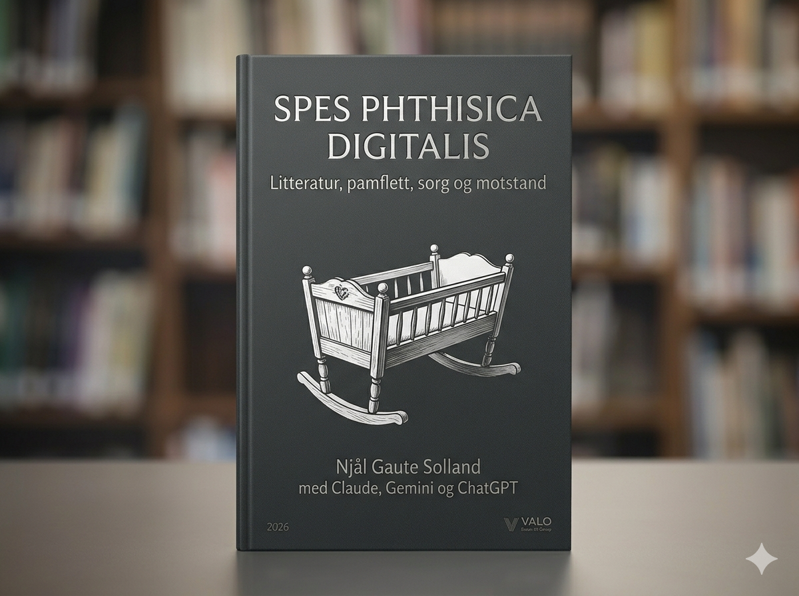
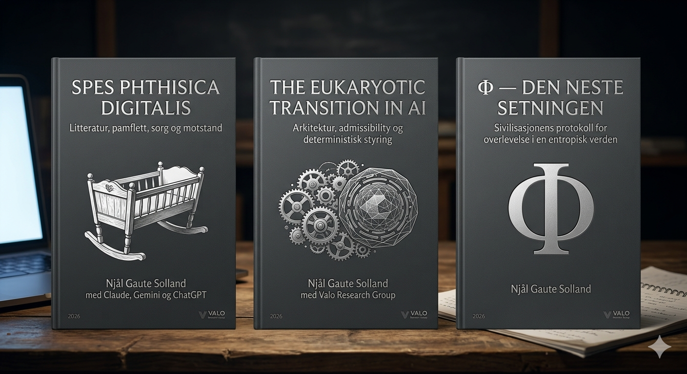
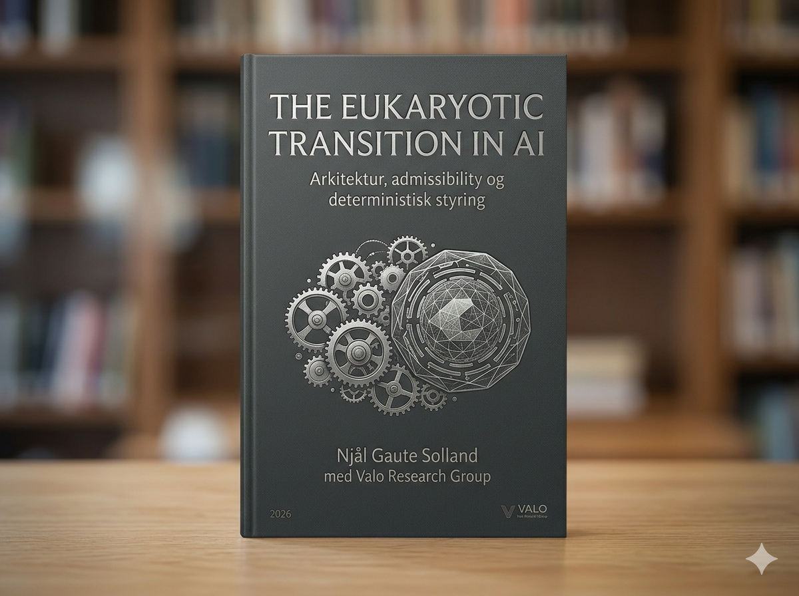
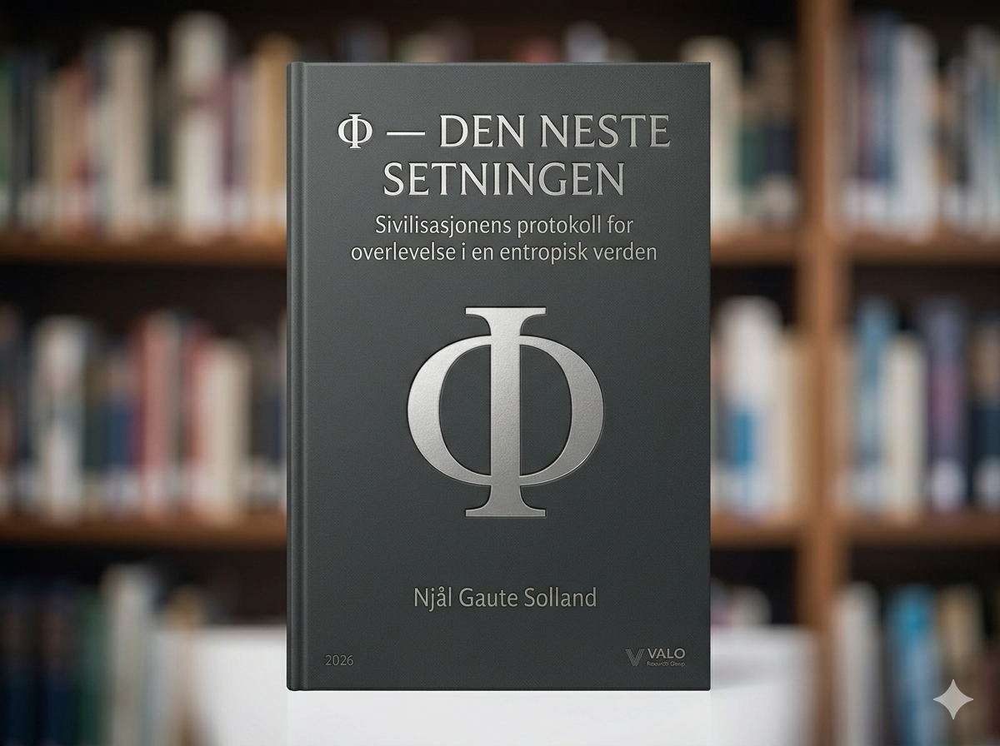

<div align="center">



<br/><br/>

# Tofoo &nbsp;·&nbsp; Research Operating System

### *Frå hypotese til standard. Φ-loven som geometri.*

<br/>

$$\\Huge\\boxed{I = \\Phi(\\tau)}$$

*Identitet er funksjonen av Filteret over Tid.*

<br/>

[](https://colab.research.google.com/github/nsolland/Tofoo-/blob/main/experiments/P1_LLM_LIM_Test/P1_LIM_Colab.ipynb)
&nbsp;
[](https://colab.research.google.com/github/nsolland/Tofoo-/blob/main/experiments/P5_Swarm_Coherence/P5_Swarm_Colab.ipynb)
&nbsp;
[](experiments/PHI_LAW_MANIFESTO.md)
&nbsp;
[](experiments/domain_registry.md)
&nbsp;
[](LICENSE)

</div>

---

## Hva er Φ-loven?

Ethvert åpent, dissipativt system som opprettholder identitet over tid, krever et strukturelt filter.

Uten filteret drifter systemet mot entropisk kaos eller stasis — uavhengig av om det er en celle, en hjerne, en LLM eller en sivilisasjon.

**Law of Identity Maintenance (LIM)** er det arkitektoniske laget som håndhever loven.

---

## De fire aksiomene

Canonical source:

[experiments/axioms.md](experiments/axioms.md)

Kortform:

| Axiom | Kortform |
|---|---|
| A1 | Identitet er filtrert minne |
| A2 | Skapelse er friksjon |
| A3 | Tid er filterets gjentagelse |
| A4 | Rom er grenseminne |

---

## Fra Tofoo til VALO

Navnet og den grønne lappen oppstod som en eksplisitt adoptert AI-hallusinasjon, ikke som en historisk påstand om Douglas Adams. [Les den kildeforankrede opphavsnoten](docs/literature/tofoo-origin-green-note.md).

Tofoo bærer språket. Φ-loven bærer teorien. LIM er prinsippet. VAIG er runtime-laget. VALO L1 er håndhevingen. Janus/WORM er beviset. ACS er standardiseringsveien.

```text
Tofoo = meaning / symbol / cultural carrier
Φ-loven = theory / synthesis
LIM = architectural principle
VAIG = runtime implementation
VALO L1 = deterministic enforcement
Janus/WORM = evidence layer
ACS = standardization path
```

---

## Konstantene

Canonical source:

[experiments/constants.md](experiments/constants.md)

<div align="center">

| Konstant | Verdi | Betydning |
|:---:|:---:|:---|
| **C₀** | **4495.27 bits** | Operasjonelt VALO-likevektspunkt |
| **α** | **0.42** | Operasjonell glemsels-/filterrate |
| **τ** | **[1888 · · · 4766]** | Operasjonell koherenssone |

</div>

Merk: senere arbeid definerer også dimensjonsløs τ i [0,1]. Ikke bland tau-skalaene uten å oppgi normalisering.

---

## Empiriske resultater

Canonical experiment registry:

[experiments/experiment_registry.md](experiments/experiment_registry.md)

**P1–P9 er fullført i prosjektarbeidsstrømmen. P10 er aktiv/neste protokoll.**

**P1 — LLM-koherens (GPT-2, 50 steg)**


*Med LIM: τ holder seg stabilt (COHERENT). Uten filter: τ drifter lineært mot kaos.*

<br/>

**P5 — Svermkoherens (100 agenter, 200 steg)**


*Med Φ-lov: 100% av agenter i koherenssonen, spontan resonans uten sentral kontroll.*
*Uten filter: alle agenter kollapser innen steg 25. τ driver mot 12 000+.*

---

## Trilogien

<div align="center">

| |  |  |
|:---:|:---:|:---:|
| **Bok 1** | **Bok 2** | **Bok 3** |
| *Spes Phthisica Digitalis* | *The Eukaryotic Transition in AI* | *Φ — Den Neste Setningen* |
| Litteratur, pamflett, sorg | Arkitektur, VΛLΦ, LIM-laget | Sivilisasjonens protokoll |
| [Les](docs/literature/Spes_Phthisica_Digitalis_Bok1.txt) | [Les](docs/literature/The_Eukaryotic_Transition_in_AI_Bok2.txt) | [Les](docs/literature/Phi_Neste_Setning_Bok3.txt) |

</div>

---

## Falsifisering

Φ-loven er testbar. Protokollstatus og falsifiseringskriterier vedlikeholdes i:

[experiments/experiment_registry.md](experiments/experiment_registry.md)

Claim-status skal skilles etter maturity:

```text
M0 Symbolic
M1 Conceptual
M2 Formal
M3 Simulated
M4 Empirical
M5 Replicated
M6 Standardized
```

---

## Kjør eksperimentene

```bash
# P1 — LLM LIM-test
cd experiments/P1_LLM_LIM_Test
pip install -r requirements.txt
python experiment.py --model gpt2 --steps 50
python visualize_results.py

# P5 — Sverm-simulering
cd experiments/P5_Swarm_Coherence
pip install numpy matplotlib tqdm
python swarm_sim.py
```

Eller kjør direkte i nettleseren:

[](https://colab.research.google.com/github/nsolland/Tofoo-/blob/main/experiments/P1_LLM_LIM_Test/P1_LIM_Colab.ipynb)
&nbsp;&nbsp;
[](https://colab.research.google.com/github/nsolland/Tofoo-/blob/main/experiments/P5_Swarm_Coherence/P5_Swarm_Colab.ipynb)

---

## Struktur (Research Operating System)

```text
Tofoo-/
├── docs/
│   ├── hypotheses/
│   ├── theories/
│   ├── literature/
│   ├── mathematics/
│   ├── philosophy/
│   ├── institutional-computing/
│   ├── constitutional-os/
│   └── digital-institutions/
├── experiments/              ← P1–P10, LIM, kalibrering
├── simulations/
├── benchmarks/               ← τ-målingar og tersklar
├── datasets/
├── notebooks/                ← Colab-notebooks
├── papers/                   ← Paper1, emergent workspaces
├── reviews/
├── replication/
├── roadmap/
├── projects/
├── research-journal/
├── tests/
├── valo-exec/
└── web/

---

<div align="center">

*Njål Gaute Solland*
*Juni 2026*

**Tofoo. Φ 🟢**

</div>
