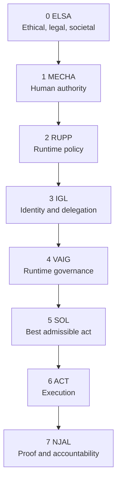
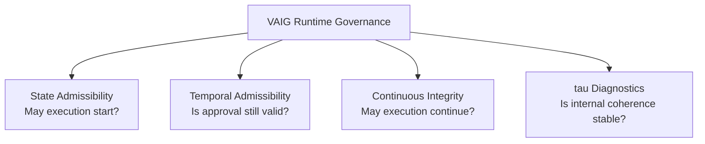

# Governance Execution Architecture / VALO 2.1

Date: 2026-07-01  
Status: repository research note  
Scope: VALO / VAIG / ACS / reht / BARO / SOL / NJAL

This note does not replace `SYSTEM_MAP.md`.

`SYSTEM_MAP.md` remains the controlling repository map. This file records the emerging VALO 2.1 / Governance Execution Architecture framing for later review.

## Core conclusion

Runtime governance is no longer an isolated idea.

The 2025-2026 research and market pattern is converging around the same execution problem:

```text
Ability is not authority.
Authority is not enough.
Admissibility must remain live.
```

VALO 2.1 should therefore be positioned as a complete Governance Execution Architecture, not as a claim to have invented every component in the field.

The contribution is the integrated stack:

- normative grounding
- human authority
- runtime policy
- identity and delegation
- pre-execution admissibility
- temporal validity
- continuous integrity
- structural coherence diagnostics
- optimization among admissible actions
- execution adapters
- cryptographic receipts and accountability

## Naming

Use this naming hierarchy:

```text
Governance Execution (GE)
  The problem domain / discipline.

Governance Execution Architecture (GEA)
  The reference architecture.

VALO 2.1
  The VALO architecture profile for GEA.

VAIG
  The runtime governance engine inside VALO.

ACS
  The open action-control and receipt protocol.

VACS
  The VALO profile / implementation path for ACS.
```

Avoid using `GEM` as the primary name. It is too generic and already overloaded across technical domains.

## VALO 2.1 stack

```text
0. ELSA
   Ethical, legal and societal foundation

1. MECHA
   Human authority, mandate and accountability

2. RUPP
   Runtime policy, permission and proof framework

3. IGL
   Identity, delegation and actor legitimacy

4. VAIG Runtime Governance Engine
   4.1 State Admissibility
   4.2 Temporal Admissibility / TAD
   4.3 Continuous Integrity
   4.4 Structural Coherence Diagnostics / tau
   4.5 Runtime threat and risk evaluation
   4.6 Sufficient verifiable proof
   4.7 Allow / Modify / Defer / Deny / Step-up / Halt

5. SOL
   Selection Optimization Layer: choose the best admissible action

6. ACT
   Execution adapters and side-effect boundary

7. NJAL
   Non-repudiation, jurisdictional accountability and legal proof
```

## Mermaid view



## VAIG module view



## Open adapter model

GEA should be treated as an open adapter architecture.

The stable spine is:

```text
ELSA -> MECHA -> RUPP -> IGL -> VAIG -> SOL -> ACT -> NJAL
```

Adapters can be replaced or extended as long as they preserve the ACS contract.

| Layer | Adapter examples |
|---|---|
| RUPP | EU AI Act, ISO/IEC 42001, NIST AI RMF, sector policy, corporate policy |
| IGL | Microsoft Entra ID, Okta, BankID, Altinn, OAuth, SAML, passkeys |
| VAIG | state admissibility, TAD, continuous integrity, tau, risk scoring, domain validators |
| SOL | cost, risk, speed, compliance, carbon, customer value, revenue |
| ACT | ERP, CRM, email, banking, GitHub, Slack, Kubernetes, browser, robotics |
| BARO | SIEM, SOC, news, market data, regulatory updates, logs, external APIs |
| NJAL | WORM log, cryptographic receipts, route receipts, jurisdictional audit trail |

ACS is the adapter contract.

It should standardize at least:

- authority
- identity
- evidence
- policy
- context
- admissibility
- decision
- receipt

## Relation to external Execution Governance work

External Execution Governance research is useful category evidence.

Relevant public source cluster reported in project context:

- Execution Governance Canonical Definition Package, DOI: 10.5281/zenodo.20582620
- Pre-Execution Authorization Layer, DOI: 10.5281/zenodo.20582754
- Mapping Execution Governance Crosswalk, DOI: 10.5281/zenodo.20582906
- From Governed Effects to Pre-Execution Authorization, DOI: 10.5281/zenodo.20583103
- Ability Is Not Authority, DOI: 10.5281/zenodo.20583217
- Execution Governance: A Structural Control Layer for Autonomous Systems, DOI: 10.2139/ssrn.6424759

Do not present VALO as the sole origin of the whole category.

A stronger and more defensible position is:

```text
Execution-governance research identifies the execution boundary.
VALO 2.1 proposes a complete Governance Execution Architecture for that boundary.
VAIG implements runtime admissibility and integrity checks.
ACS provides the open protocol surface.
```

## Research source map

Status: source map from project research notes. Items without URL or DOI still need exact source verification before external citation.

### Runtime governance

- [[11]] Aegis: Cryptographic Runtime Governance for Autonomous AI Systems, March 2026.
- [[12]] Agent Runtime Governance (ARG), Watchlight AI, 12 principles for runtime governance of autonomous AI agents.
- [[13]] Attested Governance: Runtime Integrity for Autonomous Systems, June 2026.
- [[15]] Governance-in-the-Loop: Runtime Policy Enforcement.

### Pre-execution authorization

- [[19]] Execution-Time Authorization for AI Agents.
- [[20]] TrigGuard: Pre-Execution Authorization.
- [[21]] Neural Method: Pre-Execution Governance.
- [[25]] IETF Draft: A SCITT Profile for Pre-Execution AI Action Authorization Records, May 2026.

### Validation and admissibility

- [[27]] Avahi: Action Validation Layer documentation.
- [[35]] Admissibility in AI Systems, LinkedIn discussion on admissibility checking.

### Temporal validity

- [[45]] Your AI System Has a Timestamp. Does It Have Validated Temporal Context?, June 2026.
- [[47]] Temporal Breakdown in AI Governance, SSRN paper, February 2026.
- [[53]] The HTTPS of AI, execution-time governance.

### Coherence diagnostics

- [[55]] Quantifying Quantum Coherence Using Machine Learning.
- [[58]] CFIM360: Machine Coherence Drift Test.
- [[62]] Foundations of Coherence Science, SSRN paper, January 2026.
- [[104]] Spectral entropy as a metric for evaluating speech perceptual quality.
- [[105]] Spectral Properties of Complex Distributed Intelligence Systems.
- [[106]] AI systems approaching spectral coherence with photonic structures.

### Continuous integrity

- [[69]] Proofpoint: Agent Integrity Framework, 2026 Edition, five pillars framework.
- [[70]] SmartBear: Application Integrity in the AI Era, continuous assurance documentation.
- [[71]] VerifyWise: Continuous monitoring documentation.
- [[72]] Continuous monitoring helps detect drift, reduce risk and maintain oversight.

### Identity and delegation

- [[89]] Authenticated Delegation Framework, arXiv paper, January 2025.
- [[90]] IBM Agentic AI Identity Management: unifying agent identity, delegation, real-time enforcement and audit trails.
- [[91]] Dock.io: AI Agent Digital Identity documentation.

### Multi-objective optimization

- [[94]] Multi-objective optimization in AI agents.
- [[98]] Multi-objective decision-making for AI agents.

### Route receipts and proof

- [[123]] Model Routing as a Trust Problem, arXiv paper, May 2026, Route Receipts for Adaptive AI.
- [[125]] NexArt: AI Execution Integrity, capture and seal AI execution records.
- [[131]] Microsoft: Securing AI Agents with Cryptographic Receipts.

### Blockchain for accountability

- [[74]] Blockchain for AI accountability and transparency.
- [[75]] Blockchain as trust layer under AI systems.
- [[76]] Immutable audit trail / blockchain source. Source note is incomplete in project context and needs completion.

## Differentiation

The field already contains fragments:

- runtime governance
- pre-execution authorization
- action validation
- delegated authority
- continuous monitoring
- cryptographic receipts
- jurisdictional compliance
- non-repudiation

VALO 2.1 differentiates by integrating them into one stack.

Potentially distinctive VALO components:

- TAD: Temporal Admissibility Distortion
- tau-based structural coherence diagnostics in a governance context
- VAIG as a modular runtime governance engine
- ACS/VACS as a packet and receipt contract
- NJAL as proof, jurisdiction and accountability layer
- BARO as observation without decision authority
- SOL as optimization only after admissibility

## Important boundary

TAD and tau should not be presented as separate top-level governance layers.

They belong inside VAIG / the execution-governance layer:

```text
State Admissibility = may execution start?
Temporal Admissibility = is the authorization still fresh enough?
Continuous Integrity = may execution continue as conditions change?
tau Diagnostics = does the model/system state remain structurally coherent?
```

Tau is a sensor.

VAIG is the judge.

SOL selects among admissible actions.

ACT executes.

NJAL proves what happened.

## One-line positioning

VALO 2.1 is a Governance Execution Architecture for agentic AI: an open, adapter-based stack that turns authority, policy, evidence, identity, admissibility, execution and proof into one governed runtime path.
