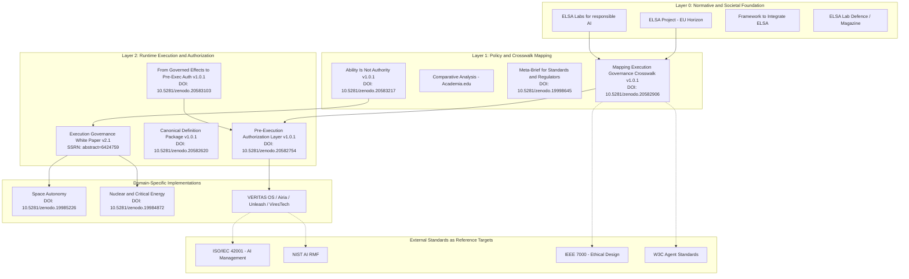

# VALO 2.1 Source Mapping and Gap Analysis

Date: 2026-07-01  
Status: repository research note  
Scope: source mapping, thesis development, standards gap analysis

This note does not replace `SYSTEM_MAP.md`.

It is based on the project source list. Sources without URLs or exact bibliographic metadata still need verification before external publication.

## 1. Architecture Diagram With Source Mapping



## 2. Thesis Development: From v1.0.1 to v2.1

The source list suggests a clear intellectual development path.

### Philosophical break

`Ability Is Not Authority` and `From Governed Effects to Pre-Execution Authorization` establish that autonomy and authorization must be separated in time.

Traditional AI governance often grants permission before a system is deployed. Execution governance moves authorization to each concrete runtime action.

### Mechanism

`Pre-Execution Authorization Layer` defines a synchronous blocking control that checks the proposed action before side effects occur.

The core questions are:

- Intent: what is the agent trying to do?
- Context: what state is the system in?
- Boundary: is this inside the defined operational envelope?

### Synthesis

The SSRN white paper appears to move from concept to structural control.

The relevant shift is from soft AI safety language to a technical enforcement boundary that can be audited, tested and potentially formally specified.

### Domain evidence

Space autonomy and nuclear / critical energy applications matter because these are high-consequence domains.

They do not prove certification or Safety Integrity Level status by themselves.

They do show that the architecture is being discussed in domains where failure tolerance is low and execution authority must be explicit.

## 3. Standards Mapping and Gap Analysis

| Standard | What the standard emphasizes | How VALO 2.1 can map to it | Gap in current source list |
|---|---|---|---|
| ISO/IEC 42001 | AI management system controls, risk treatment, operational control and monitoring | Crosswalk source maps pre-execution authorization to organizational control objectives | Missing detailed source for deviation handling after a rejected action; logging alone is not enough |
| NIST AI RMF | Govern, Map, Measure and Manage functions | Meta-brief and comparative analysis can support runtime measurement and governance functions | Missing explicit feedback loop from runtime events into updated risk models |
| IEEE 7000 | Value-based engineering and stakeholder-informed requirements | ELSA layer can translate values into technical requirements through crosswalk mapping | Missing runtime stakeholder involvement and dynamic consent / override source |
| W3C agent discussions | Agent interoperability, identity, delegation and web-facing agent behavior | ACS/VACS can provide an action-control packet and receipt surface | Missing stable standards alignment because agent standards are still emerging |

Main gap:

The sources cover the authorization moment well:

```text
May this agent perform this action now?
```

They do not fully cover the governance feedback loop:

```text
After an action is executed or rejected, how should policy, evidence requirements and risk models be updated?
```

## 4. Missing Piece

The missing source category is:

```text
Post-Execution Intent Auditing and Policy Feedback
```

VALO 2.1 needs this to become a closed-loop governance architecture.

### Source category A: Continuous Runtime Verification

Needed to validate whether the actual effect of an authorized action matched the intended effect submitted to pre-execution authorization.

### Source category B: Human-on-the-loop Override Protocols

Needed to define just-in-time authorization, escalation and emergency override in high-consequence systems.

This closes part of the IEEE 7000 / stakeholder involvement gap.

### Source category C: Federated Governance Policy Learning

Needed to aggregate rejected actions, uncertainty patterns and escalation events across many agents without exposing sensitive data.

This closes part of the NIST feedback-loop gap.

## 5. Proposed Additional Section

Suggested title:

```text
From Pre-Execution to Post-Execution: Closing the VALO Governance Loop
```

Draft thesis:

Pre-execution authorization is necessary but not sufficient for full governance execution. A governed runtime must also preserve the post-execution evidence needed to compare intended effect, authorized effect and actual effect. This feedback loop allows policy, evidence thresholds and risk models to be recalibrated without weakening the execution boundary itself.

## 6. Strategic Positioning

Do not position VALO 2.1 as the sole invention of runtime governance.

Position it as the integrated architecture that combines:

- execution boundary control
- state admissibility
- temporal admissibility
- continuous integrity
- structural coherence diagnostics
- identity and delegation
- policy adapters
- execution adapters
- route receipts
- accountability proof
- post-execution feedback

The defensible claim is:

```text
The field has fragments.
VALO 2.1 defines the complete execution-governance stack.
```
