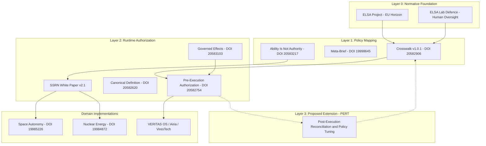

# Technical Annex: VALO Governance Architecture 2.1

Structural Runtime Control for Autonomous Systems

Document ID: VALO-TA-2.1-20260701  
Version: 2.1.x Extended  
Classification: Public – Technical Reference  
Compiled for: Research Validation and Regulatory Submission  
Originator: Based on Execution Governance research and ELSA normative frameworks

## 1. Scope and Purpose

This Annex provides a technical specification of VALO Governance Architecture 2.1, a structural control layer designed to decouple autonomous agent capability from authority at runtime.

Unlike conventional AI management systems that often apply controls at design-time or post-hoc, VALO 2.1 is framed as a runtime governance architecture for enforcing normative, ethical and legal constraints during execution cycles.

This document details the layered architecture, operational mechanisms, standard mappings, identified gaps and the proposed extension needed to close the governance loop.

## 2. Normative References

| ID | Reference | Type | DOI / Link |
|---|---|---|---|
| C1 | Execution Governance Canonical Definition Package v1.0.1 | Primary | 10.5281/zenodo.20582620 |
| C2 | Pre-Execution Authorization Layer v1.0.1 | Technical | 10.5281/zenodo.20582754 |
| C3 | Mapping Execution Governance Crosswalk v1.0.1 | Mapping | 10.5281/zenodo.20582906 |
| C4 | From Governed Effects to Pre-Execution Authorization v1.0.1 | Theoretical | 10.5281/zenodo.20583103 |
| C5 | Ability Is Not Authority v1.0.1 | Foundational | 10.5281/zenodo.20583217 |
| C6 | Execution Governance: A Structural Control Layer v2.1 | White Paper | SSRN abstract=6424759 / 10.2139/ssrn.6424759 |
| C7 | Meta-Brief for Standards Bodies and Regulators | Regulatory | 10.5281/zenodo.19998645 |
| C8 | Execution Governance for Space Autonomy | Domain | 10.5281/zenodo.19985226 |
| C9 | Execution Governance for Nuclear and Critical Energy | Domain | 10.5281/zenodo.19984872 |
| C10 | ELSA Project | Normative | EU Horizon framework |
| C11 | ELSA Labs for responsible AI / ELSA Lab Defence | Operational | External reference |
| C12 | Execution Governance: A Comparative Analysis | Analysis | Academia.edu |

## 3. Architectural Overview

The architecture is structured into decoupled layers so changes in ethics, law or institutional requirements do not require reprogramming of the autonomous agent core.



## 4. Operational Mechanism: The Three Gates

Every autonomous action should pass through a synchronous three-stage verification process.

| Gate | Parameter | Evaluation Logic | Failure Outcome |
|---|---|---|---|
| Gate 1: Intent Verification | Agent's declared goal | Does the proposed action comply with the formal operational specification? | Blocked. Agent receives an `INTENT_MISMATCH` exception. |
| Gate 2: Contextual Integrity | Current system state | Is it safe and stable to execute this action now? | Deferred until context stabilizes, or rejected with `CONTEXT_UNSTABLE`. |
| Gate 3: Boundary Enforcement | Dynamic operational limits | Does the action exceed operational boundaries? | Rejected and escalated. `BOUNDARY_EXCEEDED` triggers human oversight. |

## 5. ELSA Integration Traceability Matrix

Layer 0 does not operate in isolation. The Crosswalk translates normative values into technical runtime logic.

| ELSA Principle | Crosswalk Mapping | VALO Runtime Gate | Compliance Evidence |
|---|---|---|---|
| Human Agency and Oversight | Human intervention / oversight | Gate 1 + Gate 3 | Forces declared intent and rejects actions outside human-defined boundaries. |
| Technical Robustness and Safety | Resilience and measurement | Gate 2 | Prevents execution during degraded or unstable system states. |
| Privacy and Data Governance | Data minimization / jurisdiction | Gate 2 + Gate 3 | Blocks sensitive data movement when context or boundaries are invalid. |

## 6. Proposed Layer 3: PERT

PERT means Post-Execution Reconciliation and Policy Tuning.

Rationale:

Layers 0-2 answer:

```text
May this action execute now?
```

A complete governance cycle must also answer:

```text
Did the actual outcome match the authorized intent?
```

PERT ingests the governed effect and correlates it with the authorized intent passed through Gate 1.

### Harmony State

If intent and effect align:

```text
Intent = Effect
```

PERT records confirmed governance alignment.

### Anomaly State

If intent and effect diverge:

```text
Intent != Effect
```

PERT triggers:

1. Human escalation.
2. Dynamic boundary update.
3. Policy feedback into the Crosswalk layer.

This turns VALO from a gatekeeper into a closed-loop governance architecture.

## 7. Standards Compliance and Gap Mitigation

| Standard | Requirement | VALO 2.1 Coverage with PERT | Gap Status |
|---|---|---|---|
| ISO/IEC 42001 | Control of AI system change and operations | Pre-execution gates runtime behavioral change; PERT documents outcome | Proposed closure |
| NIST AI RMF | Govern, Map, Measure, Manage | ELSA governs, Crosswalk maps, runtime gates measure, PERT feeds manage | Proposed closure |
| IEEE 7000 | Stakeholder engagement and value-based design | Human escalation on boundary or outcome anomalies | Partial / proposed closure |
| EU AI Act | High-risk system oversight and post-market monitoring | Traceable governance decisions and post-execution reconciliation | Proposed support, not certification |

## 8. Domain Validation

The architecture is conceptually mapped against high-consequence domains.

### Space Autonomy

The pre-execution layer can handle orbital debris avoidance and thrust limits by preventing maneuvers that violate defined structural or operational boundaries.

### Nuclear and Critical Energy

Boundary enforcement can prevent control agents from exceeding predefined operating limits, while contextual integrity can lock out commands during seismic activity, grid instability or other unstable operating conditions.

These examples are conceptual mappings and do not constitute domain certification.

## 9. Key Differentiator: Decoupling Ethics from Mechanics

The central architectural edge is the structural decoupling of values from enforcement.

Traditional approach:

```text
Values embedded directly into model behavior or business logic.
```

VALO approach:

```text
ELSA declares values.
Crosswalk translates values into rules.
Runtime enforces rules mechanically.
PERT reconciles outcomes and feeds learning back into governance.
NJAL preserves proof.
```

If a law or institutional rule changes, the Crosswalk and policy adapter can be updated without retraining or rewriting the agent core.

This makes governance maintainable, auditable and adaptable.

## 10. Conclusion and Next Steps

VALO Governance Architecture 2.1 provides a structured runtime approach to the agency error in AI governance.

It shifts control from advisory policies toward runtime execution gates and proposes PERT as a post-execution reconciliation layer.

Recommended next actions:

1. Implement a minimal PERT prototype.
2. Connect PERT to VAIG receipts and NJAL proof records.
3. Test in simulated high-consequence workflows.
4. Prepare review material for standards and regulatory feedback.

## Boundary Note

This annex is a research and architecture document.

It does not claim ISO certification, regulatory approval, safety certification or domain deployment readiness.
