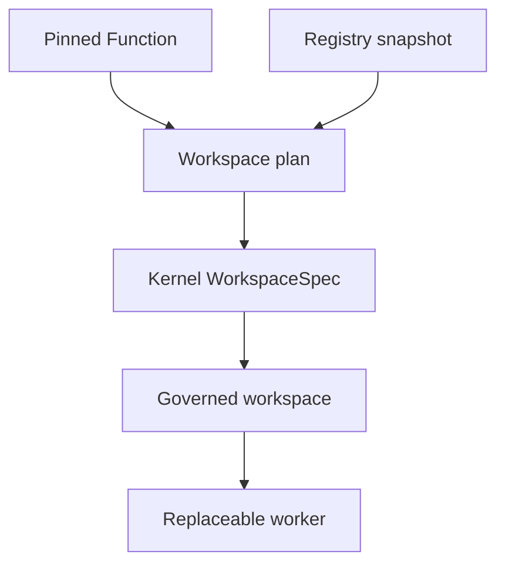

# Governed Workspace lowering

Function Fabric binds the exact pinned program that asks Kernel to compile a
governed space. It does not project state, grant authority or execute.

`compile_function_workspace_plan` verifies the registry snapshot seal, the
Function definition hash and its registered Workflow graph. The resulting
program digest binds all three into `WorkspaceSpec.program_digest`.

## Lossless governance lowering

| Function contract | Kernel workspace field |
|---|---|
| Function identity | `program_ref` |
| Definition + graph + registry snapshot | `program_digest` |
| Authority capability | capability lease request |
| Invocation target binding | explicit `target_refs` |
| Function effect set | exact `allowed_effects` union |
| Purpose requirement | selected Kernel `purpose_id` and type check |
| Autonomy default below `AUTO_EXECUTE` | `step_up_required=true` |
| Consequence-bearing function | `EXTERNAL_ACTION` candidate output |
| Function without authority requirement | `ARTIFACT`, zero actions |

For a single capability, the full declared effect set binds to that capability.
For multiple capabilities, callers must provide an explicit capability-to-
effect mapping whose union exactly equals the Function effect set. This blocks
both hidden and invented effects.

## Ownership boundaries

- Function Fabric validates the pinned program and lowers its declared
  governance without weakening it.
- Kernel independently checks current purpose, scope, permitted data and
  permitted actions, then compiles the actual state projection.
- Workers receive the resulting workspace and return candidates only.
- REHT independently reads fresh Kernel authority and remains the sole final
  authorization boundary.
- RACS and Gateway transport and execute only after those checks.

The plan carries `authority_effect=none`, `can_issue_clearance=false` and
`direct_execution=false`. Its capability entries are requests for bounded
workspace affordances, never permits.

