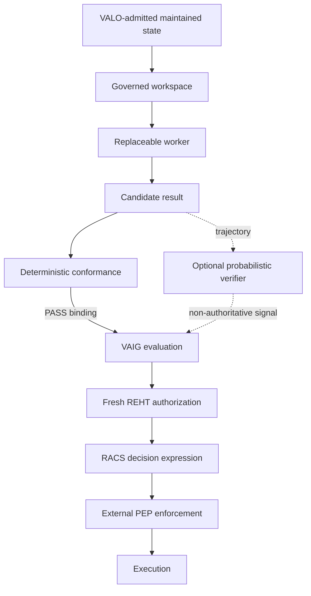

# Governed Workspace v1

VALO governs the bounded world a worker receives, then deterministically checks
the candidate result before any authorization decision is possible.

The workspace is an immutable read projection. It cannot admit information,
upgrade standing, create truth or create authority. A worker may reason over
it and return claims, artifacts or proposed actions, but cannot confirm a fact,
issue clearance or execute a capability. State admission is an upstream Kernel
boundary defined in `state_admission_v1.md`.

Persistent files, memory, configuration, instructions and handoffs are not an
ambient exception to this boundary. If such material survives a worker/session
boundary and is exposed to another governed worker, its exact bytes must first
have admitted evidence standing and a fresh `PersistentStateBinding` to the
current workspace, state root and purpose.

## Optional probabilistic trajectory verifier

A model-based verifier may be used as a replaceable assessment layer over a
candidate trajectory. It may compare candidate trajectories, estimate task
progress, surface likely failure or regression, decompose evaluation into
simpler criteria, or provide a probabilistic score to VAIG or an independent
reviewer.

This signal is advisory and non-authoritative. It is not deterministic
workspace conformance, State Admission, fresh authority evaluation, a RACS
decision, PEP enforcement or Veritas effect evidence. In particular:

- a verifier score cannot turn a failed or unresolved deterministic conformance
  result into `PASS`;
- it cannot create operative standing, confirm truth, grant authority, issue
  clearance, create an execution binding or prove that an external effect
  occurred;
- repeated evaluation may reduce variance but does not remove shared model,
  prompt or rubric bias;
- when probabilistic assessment conflicts with deterministic contract,
  provenance, freshness or authority evidence, the deterministic boundary
  controls;
- any verifier output that is persisted or reused must retain provenance to the
  exact workspace, candidate/trajectory, verifier model/configuration, rubric
  or criteria and relevant input digests, and must re-enter persistent
  operative use through the normal evidence/admission boundary.

The adopted research pattern is based on Kwok et al.,
"LLM-as-a-Verifier: A General-Purpose Verification Framework"
(arXiv:2607.05391v2): continuous probabilistic scoring, repeated evaluation and
criteria decomposition are useful ways to improve discrimination and progress
signals. The paper is research input only. Its benchmark results are not VALO
conformance evidence and introduce no runtime dependency.

## Contracts

| Contract | Binds | Authority effect |
|---|---|---|
| `WorkspaceSpec` | tenant, work unit, purpose, compiled-program digest, governing contract IDs, selectors, capabilities, outputs, expiry | none |
| `GovernedProjectionEnvelope` | exact projected objects, source state root, event position, dependency digests | none |
| `CapabilityLease` | opaque capability handle, explicit targets, effects and parameter constraints | none |
| `PersistentStateBinding` | exact persistent bytes, admitted evidence, state root, workspace and purpose | none |
| `ArtifactContextBinding` | artifact digest, workspace, invocation, candidate, worker, session, continuation nonce and lineage | none |
| `CandidateResult` | invocation, worker, workspace digest, claims, bound artifacts and proposed actions | none |
| `ConformanceReport` | workspace, candidate, current state, dependencies and deterministic outcome | none |
| `WorkspaceExecutionBinding` | tenant, expiry, source position, one conformed action, compiled program, governing contracts and complete lineage | none; input to REHT only |

## Outcomes

| Outcome | Meaning | Next action |
|---|---|---|
| `PASS` | Candidate conforms and relevant state is fresh | build an action-specific execution binding |
| `REDO` | Output or provenance is repairable | rerun or correct candidate |
| `DEFER` | Relevant state changed, workspace expired or information is unresolved | compile a fresh workspace |
| `STEP_UP` | Workspace explicitly requires independent review | route to reviewer; no execution binding |
| `DENY` | Capability, target, purpose or effect escaped the workspace | stop candidate path |
| `HALT` | Workspace/candidate binding or seal is invalid | contain and investigate |

These are deterministic workspace-conformance outcomes, not RACS execution
outcomes. In particular, workspace `DEFER`, `DENY`, `STEP_UP` and `HALT` do not
constitute or pre-issue the downstream RACS decision. Only a sealed `PASS` can
produce an execution binding, and that binding still creates no authority.

## Freshness rule

The source state root proves which complete Kernel state produced the
projection. Execution freshness is checked against the projection's material
dependencies, not against every unrelated state change in the tenant. Those
dependencies include hidden bindings to evidence, the current admission
decision behind operative projected state and every explicitly declared
governing contract. A change to unrelated state does not waste valid work. A
change to a projected object, its evidence standing, its admission decision or
a governing contract invalidates the result and requires a fresh workspace.

Governing contracts may remain hidden from the worker. Their exact canonical
digests are still mandatory dependencies. Amendment or termination produces
`GOVERNING_CONTRACT_DRIFT` and `DEFER`; workspace compilation also prevents a
workspace from outliving a governing contract.

Persistent input freshness is stricter at the worker boundary: the actual bytes
must still match the admitted evidence fingerprint and the binding must still
match the exact workspace, source state root and purpose before those bytes are
shown to the worker.

## Boundary invariants

- Projection selectors contain explicit object IDs. No broad implicit read is
  accepted.
- Every operative projection is downstream of a reproducible VALO admission
  decision. The workspace can project standing but cannot confer it.
- Evidence and admission decisions may remain hidden from the worker while
  their exact digests remain mandatory freshness dependencies.
- Authority, delegation and identity collections are not projectable through
  the workspace contract.
- Purpose bounds both projected data and leased capabilities.
- Program reference and digest bind the workspace to the exact compiled
  function or workflow that requested it.
- Governing contracts are explicit, never inferred. Their exact Kernel-state
  digests are hidden freshness dependencies and are carried into the execution
  binding. Amendment, termination or replacement invalidates the continuation.
- Capability leases use opaque handles and can never issue clearance.
- Candidate claims can never carry `CONFIRMED` truth.
- Probabilistic verifier output is evidence/assessment input only. It cannot
  override deterministic conformance, freshness, standing or authority.
- Persistence alone creates no standing. Cross-worker/session memory, config,
  instructions, handoffs or cached artifacts require exact admitted-evidence
  binding before exposure. Worker-produced artifacts must re-enter through
  evidence receipt and admission before becoming future persistent input.
- Artifact possession, validity, signature, encryption, provenance or prior
  acceptance never creates authority. Returned artifact references require an
  exact `ArtifactContextBinding`; cross-workspace or cross-invocation reuse
  fails closed.
- Only a sealed `PASS` report can bind one exact proposed action for execution.
- Kernel seals the fresh execution context with an origin/integrity proof. The
  complete sealed context digest is carried through RACS, external PEP and
  Veritas.
- A Kernel seal creates no authority. REHT must verify its tenant-bound key and
  still evaluate current authority, purpose, payload, nonce and state.
- RACS expresses the downstream execution decision; it does not enforce it.
- Enforcement belongs to a conforming external PEP.
- Kernel still does not authorize or execute.

See `governing_contract_drift_v1.md` for the governing-contract freshness rule,
`persistent_state_admission_boundary_v1.md` for the persistent-input rule,
`artifact_authority_binding_v1.md` for the artifact continuation rule,
`execution_context_origin_v1.md` for the normative seal profile and
`valo_2_governed_workspace_handoff.md` for the cross-repository review ledger.
`margaret_pef_boundary.md` defines how an optional external PEF-style adapter
may shape worker presentation without becoming a VALO dependency or weakening
temporal governance.
