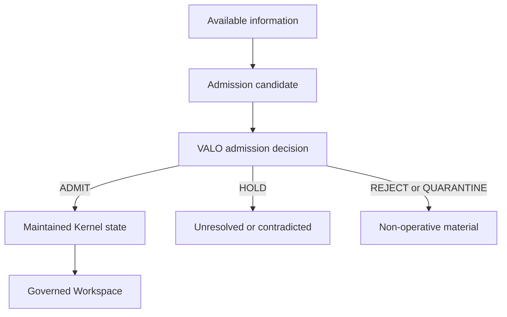

# State Admission v1

State Admission is the VALO-owned boundary between information the enterprise
can access and state VALO is entitled to treat as operative.



The architectural object is a governed operational representation, not a
claim of objective truth. Kernel owns the admission decision and the maintained
standing that follows from it. A parser, model, document store or external
framework may supply candidate material or an assessment, but cannot decide
what enters operative state.

Admission is an epistemic boundary, not an execution-decision boundary. A
`HOLD` is governed non-commitment: the premise is not presently entitled to
stand. It is not a RACS `DEFER`, `DENY` or any other downstream execution
outcome. Likewise, `ADMIT` permits material to support operative state but does
not authorize an action.

## Terms

| Term | Meaning | State effect |
|---|---|---|
| available information | document, record, observation or external material possessed or reachable by the enterprise | none |
| admission candidate | sealed provider-neutral binding of material to tenant, evidence, subjects, entities, relationships, provenance, contradictions and unresolved references | none |
| provider assessment | optional sealed input from a provider explicitly trusted by tenant policy | none |
| admission policy | VALO policy snapshot used by the deterministic evaluator | none by itself |
| admission decision | reproducible VALO result bound to candidate, policy, assessments, time and tenant | updates evidence standing only through a canonical Kernel event |
| derived-state event | explicit fact, entity, relationship or other state transition backed by admitted evidence | may update maintained state under its reducer invariants |

## Contracts

`AdmissionCandidate` uses schema `kernel_admission_candidate.v1`. It retains the
source fingerprint, evidence and material identity, entity and relationship
bindings, provenance, capture time, contradictions and unresolved references.
It declares `can_create_state = false` and `can_issue_clearance = false`.

`ProviderAdmissionAssessment` uses schema
`provider_admission_assessment.v1`. It is bound to one candidate digest, tenant,
provider, validity window and source fingerprint. The provider disposition is
one of `SUPPORT`, `REVIEW`, `PRECLUDE` or `QUARANTINE`. An assessment never
creates truth, state, authority or clearance.

`AdmissionPolicy` uses schema `kernel_admission_policy.v1`. It names allowed
material types and the exact provider IDs, if any, that the tenant trusts or
requires. `external_provider_required_by_default` is permanently false in v1.

`AdmissionDecision` uses schema `kernel_admission_decision.v1`. It binds the
candidate digest, policy digest, assessment digests, providers, decision time,
reason codes, contradictions and unresolved references. The decision owner is
always `VALO_KERNEL`. Runtime properties make the plane separation explicit:
`racs_outcome` is always `None`, `can_authorize_execution` is always false, and
only `HOLD` is classified as epistemic non-commitment. These properties do not
alter the serialized v1 contract or its digest.

## Deterministic outcomes

The evaluator applies the following precedence:

1. broken source integrity or a trusted quarantine assessment -> `QUARANTINE`;
2. disallowed material or a trusted preclusion assessment -> `REJECT`;
3. future/not-current evidence, a missing explicitly required provider, review
   requirement, contradiction or unresolved reference -> `HOLD`;
4. otherwise the native VALO policy is satisfied -> `ADMIT`.

An unknown or untrusted provider, invalid validity window, tenant mismatch,
candidate mismatch or digest mismatch fails closed instead of producing a
decision. Unknown entity and relationship bindings remain explicit unresolved
references and therefore cannot be admitted accidentally.

Outcome mapping is explicit:

| Decision | Evidence standing | May support operative derived state? | Execution-decision effect |
|---|---|---|---|
| `ADMIT` | `ADMITTED` | yes, through a separate canonical derived-state event | none |
| `HOLD` | `UNVERIFIED` or `CONTRADICTED` | no | none; epistemic non-commitment |
| `REJECT` | `REJECTED` | no | none |
| `QUARANTINE` | `QUARANTINED` | no | none |

Direct `EVIDENCE_ADMITTED` or `EVIDENCE_REJECTED` events cannot bypass the
boundary. They require a matching maintained VALO decision. A `CONFIRMED` fact
requires at least one currently admitted evidence object with a valid decision
binding. Replay recomputes every admission decision from its sealed inputs.

## Retention/custody is a separate boundary

State Admission answers whether material is entitled to participate in operative
state. It does not answer whether a system is entitled to retain, reference or
remove the underlying material over time.

Those are separate governance questions:

```text
may possess / retain / reference material  !=  may treat it as operative state
may treat material as operative state      !=  may execute an action
```

A storage layer, memory subsystem, model or external framework must not gain
standing merely because material persists. Conversely, a non-operative record
may still need lawful retention for audit or evidence purposes. Retention,
standing and execution authority therefore remain distinct planes.

VALO does not yet define a dedicated retention-right runtime contract here. If
one is introduced, it must remain provider-neutral and bind the exact material
to its principal/tenant, purpose, provenance, granting authority, validity and
revocation state. It must not mint operative standing, delegation or execution
clearance.

This distinction is the only architectural addition adopted from external
"governed memory" category work: memory persistence itself can have an authority
lifecycle. Vendor category claims, diagrams and unverified implementation claims
are research signals only, not evidence of working code and not Kernel
dependencies.

## Decision-plane separation

Admission and standing answer whether a premise may participate in operative
state. RACS expresses a downstream execution decision only after a proposed
action has passed the required workspace, conformance, freshness, evaluation
and authorization boundaries.

The outcome vocabularies are deliberately disjoint. Admission uses `ADMIT`,
`HOLD`, `REJECT`, `QUARANTINE`; RACS uses its execution-decision outcomes. No
admission outcome is converted into a RACS outcome inside Kernel. In particular,
`HOLD` must not be silently widened into `DEFER` or `DENY`.

## External-provider independence

The default path has no external provider:

```text
candidate -> native VALO policy -> admission decision
```

External systems can implement the provider assessment contract. They remain
replaceable adapters. If an adapter is unavailable, native admission continues.
Only an explicit tenant policy may require a named provider for a particular
decision; absence then yields `HOLD` for that material, not a VALO platform
outage. No named framework, person or vendor is part of the Kernel runtime
dependency graph. PEF-style state substrates, Aurora-Lens-style standing
systems and equivalent implementations may integrate through neutral contracts
without becoming internal VALO dependencies.

## Governed Workspace relationship

A workspace projects only maintained state; it cannot confer admission or
upgrade standing. The worker receives the purpose-selected objects, while the
projection binds hidden freshness dependencies for their evidence and current
admission decisions. If standing changes after compilation, deterministic
conformance returns its own workspace-level `DEFER` and the work must be
recompiled against fresh state. That conformance outcome is not a RACS outcome
and creates no execution authority.

This produces the complete ordering:

```text
candidate information
  -> VALO state admission / standing
  -> maintained governed state
  -> purpose-bounded Governed Workspace
  -> replaceable worker
  -> deterministic conformance
  -> fresh execution context
  -> VAIG evaluation
  -> REHT authorization
  -> RACS decision expression
  -> external PEP enforcement
  -> execution
  -> Veritas evidence
```

RACS expresses the downstream decision after authorization; it does not
authorize or enforce it. Enforcement belongs to a conforming external PEP. No
downstream authority or enforcement step can create standing that was absent
upstream or repair an inadmissible premise.

## Required verification

Tests must prove native operation with zero providers, explicit provider
requirement, trusted preclusion, rejection of untrusted input, unresolved
bindings, direct-event bypass rejection, tamper rejection, tenant isolation,
deterministic replay, workspace invalidation after a standing reversal, and
separation of epistemic outcomes from RACS execution outcomes.
