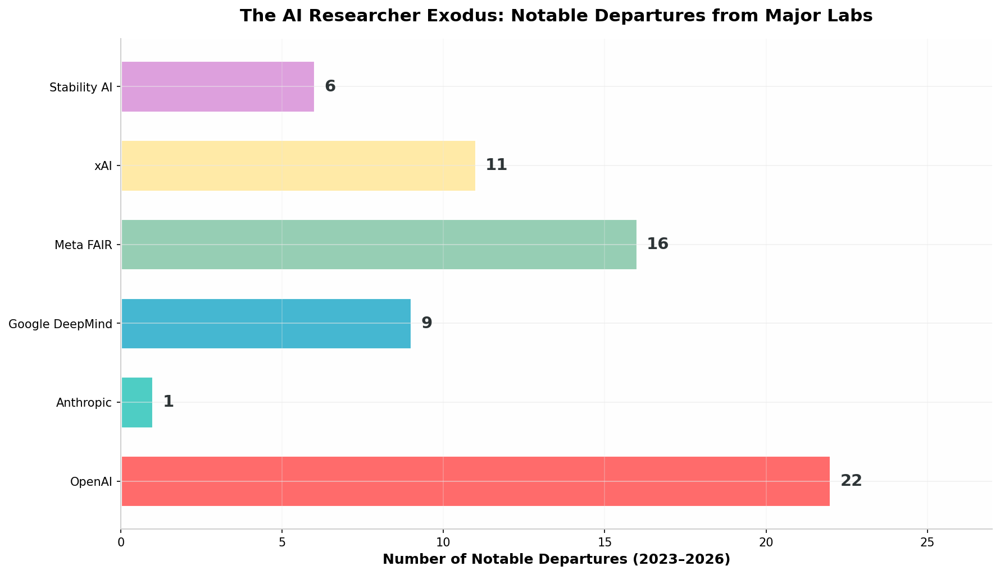
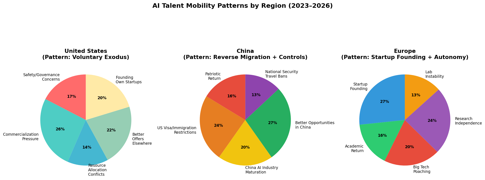
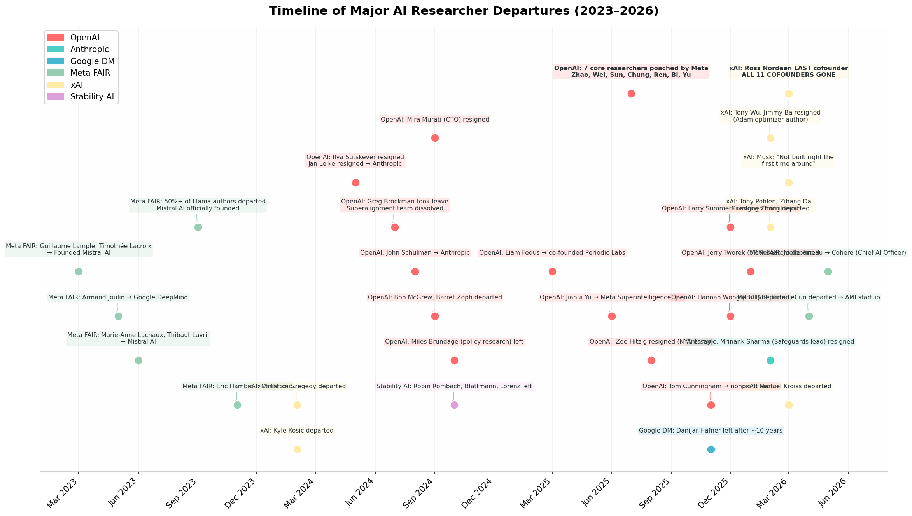

# The AI Researcher Exodus: A Global Analysis of Talent Flight from the Frontier Labs

## TL;DR

The AI researcher exodus is a **global phenomenon**, but its character varies sharply by region. In the **United States**, the "Big Five" frontier labs — OpenAI, Anthropic, Google DeepMind, Meta FAIR, and xAI — have lost **at least 65 notable researchers** between 2023 and mid-2026, driven primarily by **safety-versus-commercialization tensions**, **resource allocation conflicts**, and **aggressive poaching** (Meta alone hired 7 core OpenAI researchers in summer 2025). xAI suffered the most extreme case: **all 11 cofounders except Elon Musk departed** by March 2026. In **China**, the dynamic is **reverse migration** — "sea turtle" scientists are returning from US labs (DeepSeek, ByteDance, Alibaba, Tencent have all hired former Google/OpenAI talent), even as Beijing imposes **travel bans** on top AI researchers to prevent outbound brain drain. In **Europe**, the dominant pattern is **startup founding** — Mistral AI was built by ex-Meta FAIR researchers, and Stability AI's core team disintegrated. A parallel and disturbing thread involves **11 US scientists tied to sensitive research** who have died or disappeared since 2022, triggering FBI and congressional investigations.

---

## 1. The United States: A Voluntary Exodus Driven by Structural Tensions

### 1.1 The Scale of Departures

The American AI research landscape has experienced an unprecedented wave of voluntary departures from its most prestigious institutions. Between early 2023 and mid-2026, the five most prominent frontier labs — OpenAI, Anthropic, Google DeepMind, Meta FAIR, and xAI — collectively lost **at least 65 notable researchers and executives**, a figure that includes only publicly confirmed departures and almost certainly understates the true total. [^1^][^2^] The following chart summarizes the distribution of these departures across labs:

*Figure 1: Notable AI researcher departures by lab, 2023–2026. OpenAI leads with 22 confirmed exits, followed by Meta FAIR (16), xAI (11), Google DeepMind (9), Stability AI (6), and Anthropic (1). Data compiled from public reports, LinkedIn profiles, and company announcements.*

OpenAI alone accounts for **22 confirmed high-profile departures**, a figure that represents a staggering attrition rate for a company that began as an 11-person nonprofit. [^3^][^4^] As of early 2026, only **two of the original 11 founding members remain**: CEO Sam Altman and president Greg Brockman (who himself took extended leave in 2024 before returning). [^4^] The summer of 2025 was particularly devastating for OpenAI, when Meta successfully poached **seven core researchers** — including Shengjia Zhao (co-creator of ChatGPT and GPT-4), Jason Wei (key contributor to the o1 reasoning model), and Jiahui Yu (head of the Perception team) — for its newly announced "Superintelligence Lab." [^3^][^4^]

xAI presents the most extreme case of founder-level attrition. The company launched in March 2023 with **12 cofounders** including Elon Musk; by March 28, 2026, **all 11 non-Musk cofounders had departed**. [^19^] This roster of departures includes some of the most cited researchers in AI history: Jimmy Ba, co-author of the **Adam optimizer paper** (the most-cited paper in AI history with over 95,000 citations), resigned in February 2026 amid tensions over performance demands on Grok benchmarks. [^19^][^20^] Tony Wu, Zihang Dai, Guodong Zhang, Manuel Kroiss, Toby Pohlen, Ross Nordeen (the last to leave), Christian Szegedy, Igor Babuschkin, Greg Yang, and Kyle Kosic round out the complete cofounder exodus. [^18^][^19^]

| Lab | Confirmed Departures | % of Key Team | Primary Destinations | Primary Driver |
|-----|---------------------|---------------|---------------------|----------------|
| **OpenAI** | 22+ [^3^][^4^] | ~20% of senior research staff | Meta (7), Anthropic (6), own startups (4), nonprofits (3), unknown (2) | Commercialization vs. safety tension |
| **Meta FAIR** | 16 [^33^][^40^] | 11 of 14 Llama authors | Mistral AI (5), Cohere (2), Anthropic (1), DeepMind (1), Microsoft (1), own startups (3), back to OpenAI (2) | Resource allocation; product focus |
| **xAI** | 11 [^19^] | **100% of non-Musk cofounders** | Unknown / various [^18^] | Performance pressure; SpaceX acquisition culture clash |
| **Google DeepMind** | 9 [^24^] | ~5% of senior staff | Microsoft (5), OpenAI (1), ByteDance (1), unknown (2) | Compensation; competitive dynamics |
| **Stability AI** | 6 [^34^] | Core research team | Various [^34^] | Financial instability; cash crunch |
| **Anthropic** | 1+ [^9^] | ~2% of senior staff | Unknown [^9^] | Values alignment concerns |

*Table 1: Summary of notable AI researcher departures across major frontier labs, 2023–2026.*

### 1.2 OpenAI: From Nonprofit Ideals to Commercial Pressure Cooker

OpenAI's transformation from a nonprofit research lab into a **$157 billion for-profit juggernaut** has produced the most extensively documented researcher exodus in the industry. [^2^][^7^] The departures fall into several distinct but interconnected categories, each reflecting a different dimension of the company's internal tensions.

The **safety and governance** category includes some of the most consequential exits. Ilya Sutskever, OpenAI's chief scientist and a co-founder, resigned in May 2024 following the board's failed attempt to remove Sam Altman as CEO — an episode that exposed deep fractures in the company's governance structure. [^8^] Jan Leike, who co-led the Superalignment team with Sutskever, resigned days later, stating publicly that he had been **"disagreeing with OpenAI leadership about the company's core priorities for quite some time"** and that safety culture had been **"sacrificed for shiny products."** [^8^] The Superalignment team was dissolved entirely shortly thereafter. [^20^] John Schulman, another key safety researcher, departed for Anthropic in August 2024. Miles Brundage, head of policy research, left in October 2024, explaining that the company had become **"so high-profile that it was hard for me to publish on all the topics that are important to me."** [^7^]

The **Meta poaching wave** of summer 2025 represented a different dynamic — pure competitive recruitment powered by extraordinary financial incentives. Meta's "Superintelligence Lab," personally overseen by Mark Zuckerberg, offered packages reportedly worth up to **$300 million over four years** for top-tier researchers. [^3^][^12^] Shengjia Zhao, who became Meta's Chief Scientist for the lab, had co-created ChatGPT and GPT-4 at OpenAI. Jason Wei and Zhiqing Sun were key contributors to OpenAI's o1 reasoning architecture. Jiahui Yu had led the team that gave LLMs "senses" — image, audio, and sensor processing capabilities. Hongyu Ren and Shuchao Bi were core contributors to GPT-4o. [^3^][^4^]

The **commercialization tension** category includes researchers who left because OpenAI's shift toward rapid productization made fundamental research increasingly difficult. Jerry Tworek, a vice president of research who departed in January 2026 after seven years, explained that he wanted to pursue research areas like **continuous learning systems** that were "difficult to advance within the company." [^2^] Tom Cunningham, an economic researcher, resigned in November 2025 after concluding that the company had become reluctant to publish research highlighting AI's potentially negative economic impacts — such as job displacement — and increasingly favored work that **"promoted its commercial interests."** [^7^] Zoe Hitzig, a model policy researcher, published a guest essay in The New York Times titled **"OpenAI Is Making the Mistakes Facebook Made. I Quit."** [^1^]

| Researcher | Role at OpenAI | Destination | Departure Date | Stated Reason |
|------------|---------------|-------------|----------------|---------------|
| **Ilya Sutskever** | Chief Scientist, Co-founder | Founded SSI [^8^] | May 2024 | Governance disagreements; safety concerns |
| **Jan Leike** | Co-lead, Superalignment Team | Anthropic [^8^] | May 2024 | "Disagreements about company's core priorities" |
| **Mira Murati** | Chief Technology Officer | Founded Thinking Machines Lab [^3^] | Sep 2024 | Strategic differences |
| **Bob McGrew** | Chief Research Officer | Unknown [^3^] | Sep 2024 | Restructuring concerns |
| **Barret Zoph** | VP of Research | Unknown [^3^] | Sep 2024 | Restructuring concerns |
| **John Schulman** | Safety Researcher | Anthropic [^8^] | Aug 2024 | Safety focus alignment |
| **Miles Brundage** | Head of Policy Research | Unknown [^7^] | Oct 2024 | Publishing constraints |
| **Greg Brockman** | President, Co-founder | Extended leave [^3^] | 2024 | Burnout (later returned) |
| **Liam Fedus** | VP Research, Post-training | Co-founded Periodic Labs [^3^] | Mar 2025 | Autonomous AI scientist pursuit |
| **Shengjia Zhao** | Co-creator, ChatGPT/GPT-4 | Meta Chief Scientist [^3^] | Jul 2025 | Competitive offer |
| **Jason Wei** | o1 / Deep Research | Meta [^3^] | Jul 2025 | Competitive offer |
| **Jiahui Yu** | Head, Perception Team | Meta [^3^] | Jun 2025 | Competitive offer |
| **Hongyu Ren** | Core, GPT-4o | Meta [^3^] | Jul 2025 | Competitive offer |
| **Shuchao Bi** | Multimodal / RL | Meta [^3^] | Jun 2025 | Competitive offer |
| **Hyung Won Chung** | Research Scientist | Meta [^3^] | Jul 2025 | Competitive offer |
| **Zhiqing Sun** | Research Scientist | Meta [^3^] | Jul 2025 | Competitive offer |
| **Zoe Hitzig** | Model Policy Researcher | Unknown [^1^] | Aug 2025 | "OpenAI making mistakes Facebook made" |
| **Tom Cunningham** | Economic Researcher | Nonprofit sector [^7^] | Nov 2025 | Commercial bias in research |
| **Larry Summers** | Board Member | Resigned [^4^] | Nov 2025 | Epstein communications report |
| **Hannah Wong** | Chief Communications Officer | Unknown [^4^] | Dec 2025 | "Next chapter" |
| **Julia Villagra** | Chief People Officer | Unknown [^4^] | Aug 2025 | Unknown |
| **Jerry Tworek** | VP of Research | Unknown [^2^] | Jan 2026 | Research freedom |

*Table 2: Complete list of confirmed notable departures from OpenAI, 2024–2026, with roles, destinations, and stated reasons.*

### 1.3 xAI: The Complete Cofounder Collapse

xAI's trajectory represents a fundamentally different kind of attrition — not the gradual erosion of research talent seen at OpenAI, but a **sudden, total collapse of the founding team**. When SpaceX acquired xAI in February 2026 in an all-stock deal valuing the combined entity at **$1.25 trillion**, the acquisition triggered a cascade of resignations that left Elon Musk as the only remaining original founder by March 28, 2026. [^18^][^19^]

The departures accelerated sharply after the SpaceX acquisition, with researchers citing a fundamental **culture clash** between xAI's original research-lab orientation and SpaceX's hardware-engineering culture of extreme execution and hierarchical management. [^19^] Jimmy Ba's resignation was specifically tied to **performance pressure** on Grok benchmarks — reports indicate that Ba and colleagues were given aggressive timelines to improve Grok's performance, and the pressure crossed a threshold that made staying untenable for researchers with multiple competing offers. [^19^][^20^]

The operational significance of these departures extends beyond research capability. Ross Nordeen, the last cofounder to leave, was not a researcher but the executive responsible for **compute strategy and data center infrastructure** — the physical backbone of xAI's training capacity. [^19^] His departure, combined with Musk's public admission that xAI **"was not built right the first time around, so is being rebuilt from the foundations up,"** raises serious questions about the company's readiness for its planned mid-2026 IPO at a $1.75 trillion valuation. [^19^]

| Cofounder | Background | Departure Date | Notable Contribution |
|-----------|-----------|----------------|---------------------|
| **Kyle Kosic** | Former OpenAI | 2024 | Early engineering |
| **Christian Szegedy** | Former Google Brain | Feb 2025 | Research leadership |
| **Igor Babuschkin** | Former DeepMind/OpenAI | 2025 | Chief engineer; Grok development |
| **Greg Yang** | Former Microsoft Research | 2025 | Mathematical ML |
| **Tony Wu** | Former DeepMind/OpenAI | Feb 10, 2026 | Research science |
| **Jimmy Ba** | UofT; Adam optimizer co-author | Feb 2026 | **95K+ citations**; most-cited AI paper ever |
| **Toby Pohlen** | Former DeepMind | Feb 2026 | Engineering |
| **Zihang Dai** | Former Google | Mar 2026 | Research |
| **Guodong Zhang** | Former Google | Mar 2026 | Head of Imagine team |
| **Manuel Kroiss** | Former DeepMind | Mar 2026 | Engineering |
| **Ross Nordeen** | Former Tesla FSD | Mar 28, 2026 | **Compute strategy & data center infrastructure** |

*Table 3: Complete roster of xAI cofounder departures, 2024–March 2026. Elon Musk is the sole remaining original founder.*

### 1.4 Meta FAIR: The Llama Brain Drain

Meta's Fundamental AI Research (FAIR) lab has experienced a quieter but equally significant erosion of talent, with **11 of the 14 authors** of the landmark Llama paper having left the company as of mid-2025. [^40^] The average tenure of these departed researchers at Meta exceeded **five years**, indicating they were not transient hires but deeply embedded scientists whose departures represent a genuine loss of institutional knowledge. [^40^]

The FAIR exodus has a distinct geographical character. Five former Llama authors — Guillaume Lample, Timothée Lacroix, Marie-Anne Lachaux, Thibaut Lavril, and Baptiste Rozière — joined or founded **Mistral AI**, the Paris-based startup now valued at $6 billion that directly competes with Meta's open-source strategy. [^40^][^41^] Armand Joulin, a research director at FAIR, departed for Google DeepMind. Gautier Izacard joined Microsoft AI. Edouard Grave joined Kyutai, a French nonprofit AI lab. [^39^]

The structural driver of these departures is Meta's organizational pivot. In January 2024, FAIR was consolidated under Meta's **GenAI product team**, effectively subordinating fundamental research to product development timelines. [^33^] Researchers reported that FAIR received **less computing power** than product-focused teams, and the kind of exploratory "blue sky" research that had defined the lab's culture became increasingly difficult to pursue. [^33^] One former FAIR researcher described the lab as **"dying a slow death."** [^33^]

The irony is particularly acute: Meta is simultaneously **losing** researchers to competitors while **aggressively poaching** from them. The company hired Alexandr Wang (founder of Scale AI) for $14.3 billion to lead its new Superintelligence Labs, and in summer 2025 successfully recruited **seven core OpenAI researchers**. [^3^][^35^] But Meta's own Superintelligence Lab has already seen departures: Avi Verma and Ethan Knight both left within weeks of joining, with Verma returning to OpenAI. [^35^] Chaya Nayak, a decade-long Meta veteran, also departed for OpenAI. [^35^]

### 1.5 Google DeepMind: The Microsoft Pipeline

Google DeepMind's attrition has been less publicly dramatic than OpenAI's or xAI's, but it follows a clear directional pattern: **five senior researchers departed for Microsoft** in 2025 alone, suggesting a systematic talent pipeline from DeepMind to Microsoft's AI division. [^24^] Amar Subramanya (VP of Engineering, 15+ years at Google), Adam Sadovsky (Distinguished Engineer, 18 years), Sonal Gupta (Principal Engineer), Jonas Rothfuss (Research Scientist), and Dave Citron (Senior Director of Product at DeepMind) all made the move to Microsoft AI. [^24^]

Wu Yonghui, a former **vice president of research** at Google DeepMind, took a different path — joining **ByteDance** in 2025, representing the flow of top-tier talent from American labs to Chinese companies. [^44^] Behnam Neyshabur and Dylan Scandinaro (an AI safety researcher) both departed in early 2026, though their next destinations were not publicly announced. [^13^]

The DeepMind-Microsoft dynamic is partially personal: Mustafa Suleyman, who co-founded DeepMind with Demis Hassabis in 2010, now leads Microsoft's consumer AI push after his Inflection AI team was absorbed by Microsoft in a $650 million "acqui-hire." [^24^] This creates a natural recruitment channel between the two organizations.

### 1.6 Anthropic: The Safety Fortress — With Cracks

Anthropic has been the most successful at retaining senior research talent, a fact that reflects both its safety-first organizational culture and its structural design as a public benefit corporation. The company's most significant departure to date is **Mrinank Sharma**, who led the Safeguards Research Team and resigned in February 2026 with a public letter stating that the **"world is in peril"** and that he had **"repeatedly seen how hard it is to truly let our values govern our actions"** at Anthropic. [^9^]

Sharma's resignation is particularly notable because Anthropic was founded by OpenAI defectors — Dario Amodei, Daniela Amodei, Tom Brown, Sam McCandlish, Jared Kaplan, and others — who left OpenAI in 2021 precisely because they believed OpenAI had abandoned its safety mission. [^8^] The fact that even Anthropic is now experiencing safety-researcher departures suggests that **no frontier lab is fully immune** to the tension between competitive pressure and safety commitments.

It is worth noting, however, that Anthropic has also been a **net beneficiary** of the broader exodus. Jan Leike (OpenAI Superalignment), John Schulman (OpenAI safety), and Eric Hambro (Meta FAIR) all joined Anthropic after departing their previous labs. [^8^][^39^] The company's public benefit structure and "responsible scaling policy" appear to provide meaningful differentiation in talent retention, even if they cannot eliminate departures entirely.

---

## 2. China: Reverse Migration Meets State Control

### 2.1 The "Sea Turtle" Return Wave

While American labs are experiencing outward talent flight, China is witnessing the opposite phenomenon: a **reverse migration** of Chinese-born AI researchers who completed their doctoral training and gained experience at top US tech companies, then chose to return to China. [^44^] This "sea turtle" (海归) phenomenon — a term Chinese speakers use for educated nationals who return home — has accelerated dramatically since 2020 and represents a fundamental shift in global AI talent flows.

The scale of this reversal is quantifiable. An analysis by *The Economist* of authors at NeurIPS (the leading neural networks conference) found that in **2019, only 12%** of Chinese AI researchers who earned graduate degrees overseas returned to China. By **2025, that figure had risen to 28%** — more than doubling in six years. [^44^] While the absolute number of returnees remains relatively small, many hold pivotal positions as senior executives, chief scientists, and university professors.

The individual stories are illustrative. **Pan Zizheng**, a computer science PhD graduate, left Nvidia in 2023 to join Hangzhou-based DeepSeek — a startup that became the top free app on Apple's US App Store just over a year later. [^44^] **Wu Yonghui**, former vice president of research at Google DeepMind, joined ByteDance in 2025. **Vinces Yao**, who led agent projects at OpenAI, became chief AI scientist at Tencent. **Zhou Hao**, formerly head of reinforcement learning for Google's Gemini, joined Alibaba in January 2026. [^44^] Their trajectories follow a remarkably consistent pattern: undergraduate education in China, doctoral training in Europe or America, experience at major international tech firms, then a return to China.

| Researcher | Previous Role | Chinese Destination | Return Year |
|------------|--------------|---------------------|-------------|
| **Pan Zizheng** | Nvidia | DeepSeek | 2023 [^44^] |
| **Yang Zhilin** | Google Brain, Meta | Founded Moonshot AI | 2023 [^44^] |
| **Wu Yonghui** | VP Research, Google DeepMind | ByteDance | 2025 [^44^] |
| **Vinces Yao** | Agent Projects Lead, OpenAI | Tencent (Chief AI Scientist) | 2025 [^44^] |
| **Zhou Hao** | Head of RL, Google Gemini | Alibaba | Jan 2026 [^44^] |

*Table 4: Notable Chinese-born AI researchers returning from US labs to Chinese companies, 2023–2026.*

### 2.2 Structural Drivers of Return Migration

Several converging factors explain this reversal. **Escalating US technology restrictions** on China — including export controls on advanced GPUs and investment screening — have made it increasingly difficult for Chinese nationals to work on frontier AI research in American labs without encountering legal and ethical complications. [^44^] **Tighter US immigration and visa policies** have further reduced the attractiveness of long-term American careers. Simultaneously, the **maturation of China's AI industry** — exemplified by DeepSeek's technical achievements and Moonshot AI's commercial traction — has created compelling domestic alternatives. [^44^]

Chinese universities have also stepped up recruitment, offering competitive research funding and infrastructure. The result is that Chinese AI talent now has **genuine alternatives** to American labs — alternatives that did not exist at comparable scale five years ago. As Damien Ma, director of Carnegie China, observed: "This is a highly globally mobile talent pool. They go where the most competitive, exciting sectors are. Money matters, but so does meaningful work, and the best environment to do it in." [^44^]

A striking demographic fact underscores the strategic significance of this trend: data from the Paulson Institute shows that approximately **38% of top AI researchers in the United States completed their undergraduate studies at Chinese universities**. [^44^] If a substantial portion of this talent pipeline reverses direction, the long-term competitive implications for American AI leadership are profound.

### 2.3 Beijing's Travel Bans: Containing the Outflow

Paradoxically, even as China benefits from returning talent, Beijing has become increasingly anxious about **outbound brain drain**. In early 2025, Chinese authorities began imposing **travel restrictions** on top AI professionals at private firms including Alibaba and DeepSeek, requiring government approval before overseas travel. [^22^] Bloomberg reported that the restrictions mirror those historically imposed on **"academics and nuclear scientists,"** reflecting the strategic priority President Xi Jinping has placed on AI as the "main battlefield" of international competition. [^22^]

The travel bans create a revealing asymmetry. The US is losing researchers who **choose to leave** (voluntary exodus driven by internal tensions), while China is **preventing researchers from leaving** (state-imposed controls). The former reflects organizational dysfunction; the latter reflects strategic anxiety. Both, however, point to the same underlying reality: **frontier AI researchers are the most valuable and mobile resource in the global technology competition**, and both superpowers are struggling to retain them.

The decoupling of talent flows carries risks for both sides. As Carnegie China's Ma warned: "If there's a full stoppage of the flow of human capital, that would be a big downside for both countries." [^44^] The Chinese and American AI ecosystems offer genuinely different strengths — the US leads in foundational research and compute infrastructure, while China excels in application deployment and data scale — and a complete decoupling of human capital would impoverish both.

---

## 3. Europe: Startup Founding as the Dominant Pattern

### 3.1 Mistral AI: The FAIR Diaspora Becomes a Competitor

The European AI researcher exodus follows a distinct pattern from both the American and Chinese cases. Rather than leaving for competing big-tech labs or returning from overseas, European researchers are predominantly **founding their own startups** — and those startups are becoming serious competitors to the labs they left.

The most prominent example is **Mistral AI**, the Paris-based startup now valued at **$6 billion**, which was founded in 2023 by three former Meta FAIR researchers: Guillaume Lample, Timothée Lacroix, and Arthur Mensch. [^40^][^41^] All three were authors of the original Llama paper and had spent a combined **22 years** at Meta before leaving to build an open-source alternative. [^40^] They were joined by two more former FAIR colleagues, Marie-Anne Lachaux and Thibaut Lavril, creating a team with deep institutional knowledge of Meta's most successful AI project.

Mistral's competitive threat to Meta is direct and intentional. The startup's open-weight models compete head-to-head with Llama for developer adoption, and Mistral has been particularly effective in the European market where regulatory and data-sovereignty concerns make American models less attractive. [^40^] The irony that Meta's open-source strategy — which the company promoted as a way to democratize AI — has empowered the formation of a direct European competitor staffed by its own former employees is not lost on industry observers.

### 3.2 Stability AI: Research Team Disintegration

Stability AI, the British company behind Stable Diffusion, experienced a different kind of European exodus — one driven not by competitive opportunity but by **financial and organizational dysfunction**. In early 2024, the three researchers who led the development of Stable Diffusion — Robin Rombach, Andreas Blattmann, and Dominik Lorenz — all resigned, removing the core technical team that had defined the company's most significant product. [^34^]

The departures were part of a broader organizational collapse. Stability AI was reportedly spending **$8 million per month** while generating only $1.2–3 million in monthly revenue. [^34^] Investment firms Coatue and Lightspeed both resigned from the board. Multiple vice presidents, the research chief (David Ha), the LLM leads, the general counsel, the chief people officer, and the COO all departed within a compressed timeframe. [^34^] The case illustrates how European AI startups, despite generating breakthrough research, can fail to translate technical success into sustainable business models — and how that failure triggers a complete research-team dispersal.

### 3.3 Other European Patterns: Academic Returns and Nonprofit Labs

Beyond Mistral and Stability AI, European AI talent mobility includes several other notable patterns. **Armand Joulin**, a research director at Meta FAIR for nearly nine years, departed for **Google DeepMind** in 2023, becoming one of the few European researchers to move between American big-tech labs rather than founding a startup. [^39^] **Edouard Grave** joined **Kyutai**, a French nonprofit AI lab, reflecting Europe's distinctive ecosystem of publicly funded research institutions that provide alternatives to both corporate labs and startup entrepreneurship. [^39^]

The European pattern can be summarized as follows: researchers leave American corporate labs to pursue **greater autonomy** (through startup founding), **research independence** (through nonprofit labs like Kyutai), or **academic careers** (returning to European universities). The absence of European equivalents to Meta's $300 million compensation packages means that financial retention is less viable; instead, European labs and institutions compete on **quality of life, research freedom, and public-interest alignment**.

*Figure 2: Regional patterns of AI talent mobility. The US pattern is characterized by voluntary exodus driven by safety-commercialization tensions and aggressive poaching. China's pattern combines reverse migration (sea turtles returning) with state-imposed travel bans to prevent outbound brain drain. Europe's pattern centers on startup founding and research autonomy.*

---

## 4. The Disturbing Parallel: Scientists Tied to Sensitive Research

### 4.1 The FBI Investigation

Running parallel to the AI researcher exodus — and conceptually distinct from it, though potentially related in the public imagination — is a disturbing pattern of **deaths and disappearances among US scientists** with access to sensitive government research. Since 2022, at least **11 scientists and government workers** affiliated with nuclear weapons programs, NASA's Jet Propulsion Laboratory (JPL), or other classified research facilities have died or vanished under circumstances that prompted federal investigation. [^29^][^32^]

The FBI announced in April 2026 that it would lead a multi-agency effort to **"look for connections"** among the cases, working with the Department of Energy, Department of Defense, and state and local law enforcement. [^29^] The House Oversight Committee launched its own parallel investigation, with Chairman James Comer stating that the deaths and disappearances are **"unlikely to be a coincidence."** [^36^] President Trump told reporters: "I just left a meeting on that subject, so pretty serious stuff … hopefully coincidence, but some of them were very important people and we're gonna look into it." [^29^]

### 4.2 The Cases

The 11 affected individuals span a range of scientific disciplines and circumstances, from apparent accidents to violent deaths to unexplained disappearances:

| Name | Affiliation | Status | Date | Circumstances |
|------|------------|--------|------|---------------|
| **Amy Eskridge** | Institute for Exotic Science | Deceased | Jun 2022 | Self-inflicted gunshot; alleged harassment before death [^28^] |
| **Michael Hicks** | NASA JPL | Deceased | Jul 2023 | Died at age 59; circumstances unclear [^32^] |
| **Frank Maiwald** | NASA JPL | Deceased | Jul 2024 | Principal researcher died; cause not public [^28^] |
| **Monica Jacinto Reza** | NASA JPL / Aerojet Rocketdyne | **Missing** | Jun 2025 | Disappeared while hiking; never found [^28^] |
| **Steven Garcia** | Kansas City National Security Campus | **Missing** | Aug 2025 | Left home with handgun; high-level security clearance [^28^] |
| **Nuno Loureiro** | MIT Plasma Science & Fusion Center | Deceased | Dec 2025 | Shot at home; suspect was Brown University shooter [^32^] |
| **Jason Thomas** | Novartis | Deceased | Dec 2025–Mar 2026 | Missing; body recovered from lake 3 months later [^32^] |
| **Neil McCasland** | Retired Air Force Major General | **Missing** | Feb 2026 | Disappeared from Albuquerque home [^32^] |
| **Carl Grillmair** | Caltech Astrophysicist | Deceased | Feb 2026 | Shot on front porch; suspect recently released from prison [^32^] |
| **Additional unnamed cases** | Various sensitive facilities | Various | 2022–2026 | Under investigation [^29^] |

*Table 5: Scientists and government personnel tied to sensitive US research who have died or disappeared since 2022, triggering federal investigation.*

### 4.3 Assessment and Context

Investigators and experts have cautioned against assuming a coordinated plot. "The deaths and missing persons cases are scattered across several years at different and only loosely affiliated organizations," noted Joseph Rodgers of the Center for Strategic and International Studies. [^32^] The FBI and Massachusetts authorities conclusively determined that the murder of MIT professor Nuno Loureiro had **"no nexus to terrorism"** and was committed by a Portuguese national with personal grievances. [^36^]

However, the cluster of cases involving personnel from **Los Alamos National Laboratory** and **NASA JPL** — combined with the geopolitical context of intensifying great-power competition — has fueled legitimate concern. The Trump administration's directive for a comprehensive interagency review reflects a prudent recognition that even if individual cases are unconnected, the **aggregate pattern** warrants scrutiny when it involves personnel with access to nuclear secrets and advanced aerospace technology.

The connection to the AI researcher exodus is thematic rather than causal. Both phenomena involve **highly skilled scientists with access to strategically sensitive capabilities** becoming unavailable to their institutions — in one case through voluntary resignation, in the other through death or disappearance. The parallel has not gone unnoticed in national security circles, where the protection of AI talent is increasingly framed as comparable to the protection of nuclear scientists during the Cold War.

---

## 5. Comparative Analysis: Three Models of Talent Mobility

### 5.1 The Fundamental Differences

The AI researcher exodus is not a single phenomenon but **three distinct patterns** superimposed on a global competitive landscape. Understanding their differences is essential for policymakers, investors, and lab leaders attempting to navigate the talent crisis.

*Figure 3: Timeline of major AI researcher departures across labs, March 2023 to June 2026. The density of departures increased sharply in 2024–2025, with OpenAI and xAI experiencing the most concentrated waves.*

| Dimension | United States | China | Europe |
|-----------|--------------|-------|--------|
| **Primary pattern** | Voluntary resignation from big-tech labs [^1^][^2^] | Reverse migration (returning sea turtles) [^44^] | Startup founding by ex-big-tech researchers [^40^] |
| **Direction of flow** | Outward (from labs to startups/competitors) [^12^] | Inward (from US labs to Chinese companies) [^44^] | Dispersal (from US corporate labs to EU startups) [^40^] |
| **Dominant driver** | Safety vs. commercialization tension [^7^][^8^] | National industrial policy + US visa restrictions [^44^] | Research autonomy + entrepreneurial opportunity [^33^] |
| **State role** | Minimal (market-driven) | Active (travel bans, recruitment incentives) [^22^] | Moderate (funding for nonprofit labs like Kyutai) |
| **Compensation factor** | Extreme packages ($300M/4yr at Meta) [^12^] | Competitive domestic offers + patriotism [^22^] | Lower compensation; lifestyle/research quality tradeoff |
| **Key entities losing talent** | OpenAI, xAI, Meta FAIR [^1^][^19^][^33^] | None (net gainer) | Meta FAIR (European researchers) [^40^] |
| **Key entities gaining talent** | Meta (from OpenAI), Anthropic (from OpenAI), startups [^3^][^8^] | DeepSeek, ByteDance, Alibaba, Tencent, Moonshot AI [^44^] | Mistral AI, Kyutai, European universities [^40^] |
| **Risk profile** | Lab instability; safety research erosion [^9^] | Geopolitical decoupling; talent market fragmentation [^44^] | Startup mortality (Stability AI case) [^34^] |

*Table 6: Comparative analysis of AI talent mobility patterns across the United States, China, and Europe, 2023–2026.*

### 5.2 The Meta-Anomaly: Poacher and Prey

Meta occupies a unique position in this landscape as both **the most aggressive poacher** and **a significant victim** of talent flight. The company hired **seven core OpenAI researchers** in summer 2025 for its Superintelligence Lab, spent **$14.3 billion** to acquire Alexandr Wang and a stake in Scale AI, and reportedly offers packages up to **$300 million over four years** for top-tier researchers. [^3^][^12^] Simultaneously, Meta has lost **11 of 14 Llama authors**, its FAIR lab director (Joelle Pineau), its chief AI scientist (Yann LeCun), and multiple researchers who left its own Superintelligence Lab within weeks of joining. [^33^][^35^][^40^]

This paradox illuminates a deeper truth about the current AI talent market: **compensation alone is insufficient for retention** when researchers are motivated by factors like safety alignment, research autonomy, or organizational culture. Meta can outbid virtually any competitor on salary, but it has struggled to create an environment where fundamental researchers feel their work is valued relative to product-driven initiatives. As one former FAIR researcher observed: "FAIR at its peak circa 2019 was a very special place" — but Zuckerberg "clearly values GenAI over FAIR at this point." [^33^]

### 5.3 The Safety Research Erosion

A cross-cutting concern across all three regions is the **erosion of dedicated AI safety research capacity**. In the United States, OpenAI dissolved its Superalignment team, Anthropic lost its Safeguards Research lead, Meta saw its AI safety researcher Dylan Scandinaro depart, and xAI dropped its public-benefit corporation status while losing all researchers who had expressed safety-oriented views. [^9^][^20^] In China, the focus on commercial and strategic competition leaves little visible space for safety research as a distinct discipline. In Europe, the nonprofit model (Kyutai) and public funding mechanisms provide some safety-research infrastructure, but at a smaller scale than the American labs.

The forty-plus AI researchers who issued a joint warning in August 2025, referenced in the source material, represents one response to this erosion — an attempt by the research community to exert external pressure where internal organizational mechanisms have failed. [^29^] Whether such collective action can compensate for the institutional dissolution of safety teams remains an open question.

---

## 6. Implications and Outlook

### 6.1 For the AI Industry

The researcher exodus has several immediate implications for the development of frontier AI. **Concentration risk** is increasing: as talent disperses from established labs into startups (SSI, Thinking Machines Lab, Periodic Labs, Mistral AI), the industry's knowledge base becomes more fragmented. This fragmentation could accelerate innovation through competition, but it could also impede the kind of large-scale, coordinated safety research that requires stable, well-resourced institutional homes.

**Benchmark competition** is intensifying as a direct consequence of researcher mobility. When Meta hired seven core OpenAI researchers, it gained not just talent but **tacit knowledge** about OpenAI's training methodologies, architecture decisions, and research priorities. The competitive dynamic that drove Jimmy Ba's departure from xAI — pressure to improve Grok's benchmark performance — is emblematic of an industry where model evaluations have become both a marketing tool and a retention mechanism. [^19^]

### 6.2 For National Security Policy

The convergence of AI researcher mobility and the mysterious deaths/disappearances of sensitive-research scientists has begun to reshape national security discourse. The House Oversight Committee's investigation explicitly frames both phenomena as potential threats to **"U.S. personnel with access to scientific secrets."** [^28^] The FBI's multi-agency review represents an institutional recognition that AI researchers — particularly those working on capabilities that could have military applications — may require protective measures comparable to those historically applied to nuclear scientists.

China's travel bans on AI researchers represent the other side of this policy response: a preemptive restriction on talent mobility justified by national security. [^22^] The risk is that both countries' security concerns become self-fulfilling prophecies — as restrictions on researcher movement increase, the researchers themselves may become more reluctant to work on sensitive projects, accelerating the very brain drain that the restrictions are designed to prevent.

### 6.3 For the Future of AI Safety

The most consequential long-term question is whether the dissolution of dedicated safety teams at OpenAI, xAI, and elsewhere represents a **temporary reallocation of resources** or a **permanent deprioritization** of safety research. OpenAI chief research officer Mark Chen has insisted that "foundational research remained central to the company's mission and accounted for most of its computing resources and investment." [^2^] Anthropic's responsible scaling policy remains in place. DeepMind continues to publish safety research through its blog and academic channels. [^1^]

Yet the pattern is unmistakable: the researchers who have chosen to leave are disproportionately those who worked on **governance, alignment, and safety** — the very capabilities that become more critical as models approach frontier performance. Jan Leike's warning that OpenAI had sacrificed safety culture for "shiny products" now echoes across multiple labs. [^8^] If the industry cannot find a way to make safety research compatible with competitive commercialization, the exodus will continue — and the world will face increasingly powerful AI systems developed with diminishing institutional capacity to understand or constrain their risks.

---

## 7. Why They Left: The Leaked Evidence and Insider Accounts

The preceding sections documented *who* left and *where* they went. This section examines the harder question: *why* they left, based on leaked documents, public resignation letters, insider testimony, and investigative reporting. The evidence points to a consistent pattern across labs — **systematic institutional pressure to deprioritize safety in favor of speed, productization, and profit** — but the specific mechanisms vary significantly by organization.

### 7.1 OpenAI: The NDA Scandal and the Silencing of Safety Voices

#### The Vox Document Leak: Equity as a Muzzle

In May 2024, *Vox* published a bombshell investigation based on leaked OpenAI documents that revealed the company's exit agreements contained provisions threatening to **claw back all vested equity** from departing employees who refused to sign lifetime non-disparagement agreements. [^73^] For workers at a startup where equity constitutes the majority of total compensation — OpenAI's base salary is approximately $300,000 with yearly equity grants around $500,000 in profit participation units — this provision effectively meant choosing between millions of dollars and the right to speak freely about safety concerns. [^74^]

The documents obtained by *Vox* were damning. A separation letter stated in plain language: *"If you have any vested Units ... you are required to sign a release of claims agreement within 60 days in order to retain such Units."* It was signed by chief strategy officer **Jason Kwon** and VP of people **Diane Yoon** (who has since departed the company). [^73^] The ultra-restrictive NDA itself was signed by COO **Brad Lightcap**. Most critically, incorporation documents for the equity-holding company — containing language giving OpenAI near-arbitrary authority to claw back equity — were signed by **Sam Altman** on April 10, 2023. [^73^]

Altman's public response was an apology on X: *"This is on me and one of the few times I've been genuinely embarrassed running OpenAI; I did not know this was happening and I should have."* [^72^] But the documents contradicted this claim. As *Vox* noted, the seeming contradiction had ramifications "far beyond money" for a company whose stated mission was to benefit all of humanity. [^73^] The NDA scandal was particularly damaging because it explained why so many departing researchers had been silent about their reasons for leaving — they were legally prevented from speaking.

#### Daniel Kokotajlo: Sacrificing 85% of Family Net Worth to Speak

The human cost of this policy became visible through **Daniel Kokotajlo**, a philosophy PhD who worked on OpenAI's governance team. In April 2024, Kokotajlo resigned and posted publicly that he left *"due to losing confidence that [OpenAI] would behave responsibly around the time of AGI."* [^8^] To retain his freedom to speak, he **refused to sign the NDA**, forfeiting approximately **$2 million in vested equity** — representing roughly **85% of his family's net worth** at the time. [^8^]

Kokotajlo later elaborated on LessWrong: *"I joined with the hope that we would invest much more in safety research as our systems became more capable, but OpenAI never made this pivot. People started resigning when they realized this. I was not the first or last to do so."* [^83^] He described the off-boarding paperwork as making it *"clear... that I would lose my vested equity in 60 days if I refused to sign,"* and explained that *"my wife and I thought hard about it and decided that my freedom to speak up in the future was more important than the equity."* [^83^]

The scale of the silencing became apparent through subsequent reporting. According to the AI Whistleblower Initiative, OpenAI's non-disparagement agreements had bound **over 500 former employees for life**, barring them from criticizing the company under threat of losing vested equity, with only **5 publicly confirmed as released** from these restrictions. [^92^]

#### Jan Leike's Resignation Tweet Thread: The Full Account

**Jan Leike**, co-lead of the Superalignment team, initially posted only two words on X — *"I resigned."* — on May 14, 2024. [^55^] Under OpenAI's NDA regime, this terse announcement was likely all he could safely say without jeopardizing millions in equity. But the following day, Leike made the extraordinary decision to accept the financial penalty and publish a detailed explanation. His tweet thread became the most consequential insider account of OpenAI's internal culture ever made public. [^52^][^54^]

> *"I have been disagreeing with OpenAI leadership about the company's core priorities for quite some time, until we finally reached a breaking point."* [^54^]

> *"I believe much more of our bandwidth should be spent getting ready for the next generations of models, on security, monitoring, preparedness, safety, adversarial robustness, (super)alignment, confidentiality, societal impact, and related topics. These problems are quite hard to get right, and I am concerned we aren't on a trajectory to get there."* [^52^]

> *"Over the past few months my team has been sailing against the wind. Sometimes we were struggling for compute and it was getting harder and harder to get this crucial research done."* [^56^]

> *"Building smarter-than-human machines is an inherently dangerous endeavor. OpenAI is shouldering an enormous responsibility on behalf of all of humanity. But over the past years, safety culture and processes have taken a backseat to shiny products."* [^54^]

Leike's final message was directed at remaining OpenAI employees: *"Learn to feel the AGI. Act with the gravitas appropriate for what you're doing. I believe you can 'ship' the cultural change that's needed. I am counting on you."* [^54^] *TechCrunch* separately reported, citing a source on the Superalignment team, that *"requests for compute were often denied, blocking the team from doing their work."* [^56^]

#### The Mission Alignment Team: Created to Reassure, Dissolved After the Deal

The pattern of creating safety structures for public relations purposes, then dismantling them when they conflict with commercial interests, reached its most pointed expression with OpenAI's **Mission Alignment team**. Created in September 2024 — immediately after the simultaneous departures of CTO Mira Murati, Chief Research Officer Bob McGrew, and VP of Research Barret Zoph — the team was explicitly designed to *"help employees and the public understand our mission and the impact of AI."* [^50^] Its creation provided visible reassurance during a period of intense organizational turbulence.

The dissolution happened quietly and with revealing timing. In October 2025, OpenAI completed its conversion from a nonprofit-controlled entity to a **traditional for-profit corporation**, reducing the nonprofit board's stake to just **26%**. [^50^] In December 2025, the company secured a **$41 billion investment from SoftBank**. Within days of that deal, the Mission Alignment team was disbanded. [^50^] Team lead Joshua Achiam received a promotion to "chief futurist" and the seven team members were transferred to other roles. As analyst Annie Analytics documented, the sequence suggested a logical progression: *"Create a highly visible safety structure to reassure regulators and the public, complete the restructuring that shifts the primary objective to profit, then dissolve the structure that most directly conflicts with profit maximization."* [^50^]

Compounding this pattern, OpenAI's **2024 IRS 990 filing** — filed in late 2025 and publicly available — showed that the company had removed the word **"safely"** from its mission statement. [^61^] The 2023 filing stated the mission was *"to build general-purpose artificial intelligence (AI) that safely benefits humanity, unconstrained by a need to generate financial return."* The 2024 filing changed this to simply: *"to ensure that artificial general intelligence benefits all of humanity."* [^61^] The deletion of "safely" and the removal of the "unconstrained by financial return" clause were not announced publicly. They were discovered by researchers examining tax documents.

#### The 70-Page Dossier and Board Revelations

The most explosive internal account of OpenAI's leadership culture came from the November 2023 board crisis. According to *The New Yorker*, **Ilya Sutskever** compiled an approximately **70-page annotated dossier** consisting of internal communications, documents, and photos, which claimed that Altman *"exhibits a consistent pattern of [...] lying"* and that he *"misrepresented information to the company's senior management and board, particularly regarding safety issues."* [^77^] Two OpenAI executives separately reported *"psychological abuse"* from Altman to the board, providing screenshots and documentation of *"lying and being manipulative in different situations."* [^77^]

Former board member **Helen Toner** later stated publicly that Altman had provided *"inaccurate information about the small number of formal safety processes that the company did have in place"* and that *"many employees feared retaliation if they didn't support Altman."* [^77^] She also revealed that Altman had failed to inform the board about the release of ChatGPT and that he owned the OpenAI Startup Fund — information he had actively concealed.

These revelations, combined with the NDA scandal, the compute denials, and the mission statement alteration, paint a coherent picture: OpenAI's safety researchers were not leaving because of abstract philosophical disagreements. They were leaving because **they experienced, documented, and in some cases were silenced from reporting** a systematic institutional pattern of deprioritizing safety in favor of product speed and commercial growth.

#### Washington Post Whistleblower Reports: Safety Protocols "Squeezed" and "Skirted"

In July 2024, *The Washington Post* published investigative reporting based on accounts from multiple current and former OpenAI employees who revealed that the company's safety team had **"sped through testing protocols designed to prevent the technology [GPT-4o] from causing catastrophic harm"** to meet a self-imposed May launch date. [^90^] The employees described how OpenAI **"squeezed"** and **"skirted"** safety protocols. This reporting prompted several employees to speak out and contributed to the SEC whistleblower complaint filed by OpenAI staffers. [^90^]

Senator **Charles Grassley** (R-Iowa) subsequently sent a formal letter to Sam Altman demanding records about OpenAI's employment agreements, safety protocols, and SEC investigations, stating that the agreements *"may be stifling your employees from making protected disclosures to government regulators."* [^90^]

| Evidence Type | Source | Key Revelation | Date |
|-------------|--------|---------------|------|
| **Leaked exit documents** | Vox [^73^] | OpenAI threatened vested equity clawback for non-signers of lifetime NDAs; documents signed by Altman, Kwon, Lightcap | May 2024 |
| **Resignation tweet thread** | Jan Leike (X) [^54^] | "Safety culture and processes have taken a backseat to shiny products"; team "sailing against the wind," denied compute | May 2024 |
| **Public resignation letter** | Daniel Kokotajlo (LessWrong) [^83^] | Gave up ~$2M (85% of family net worth) to avoid NDA; "OpenAI never made this pivot" to safety | Apr 2024 |
| **IRS filing** | OpenAI 990 form [^61^] | Word "safely" removed from mission statement; "unconstrained by financial return" deleted | Filed late 2025 |
| **70-page dossier** | The New Yorker [^77^] | Sutskever compiled evidence claiming Altman "exhibits a consistent pattern of lying" about safety | Apr 2026 |
| **Board member testimony** | Helen Toner [^77^] | Altman provided "inaccurate information" about safety processes; employees feared retaliation | May 2024 |
| **Investigative reporting** | Washington Post [^90^] | OpenAI "squeezed" and "skirted" safety protocols for GPT-4o launch; prompted SEC whistleblower complaint | Jul 2024 |
| **Internal memo leak** | Axios/Platformer [^50^] | Mission Alignment team dissolved days after $41B SoftBank deal and for-profit conversion | Dec 2025 |
| **Resignation essay** | Zoe Hitzig (NYT) [^96^] | "OpenAI seems to have stopped asking the questions I'd joined to help answer"; ads on ChatGPT | Feb 2026 |

*Table 7: Summary of leaked documents, insider accounts, and investigative findings documenting why researchers left OpenAI.*

### 7.2 xAI: Performance Pressure and the SpaceX Culture Clash

While OpenAI's researcher departures were driven by safety-commercialization tension, xAI's cofounder exodus followed a different but equally documented pattern: **unreasonable performance demands** combined with a **fundamental culture clash** after the SpaceX acquisition.

The *Financial Times* reported that unnamed xAI staff complained leadership had **"over-promised to Musk on technical developments, leading to unreasonable demands."** [^47^] *Business Insider* confirmed that behind closed doors, Musk had expressed frustration with progress on **Grok Imagine** (the image/video generation tool) and **Macrohard** (the coding assistant project), and that since February 2026, xAI had **"cut dozens of employees"** across both teams while bringing in Tesla and SpaceX engineers to replace them. [^58^] The Macrohard project, which saw several leads exit, *"stalled and has since become a joint project with Tesla."* [^58^]

**Jimmy Ba's** resignation — the most technically consequential departure, given his authorship of the Adam optimizer paper with 95,000+ citations — was specifically tied to **performance pressure on Grok benchmarks**. [^19^] Reports indicated that Ba and colleagues were given aggressive timelines to improve Grok's performance, and the pressure crossed a threshold that made staying untenable for researchers with multiple competing offers. [^19^] Grok had consistently underperformed against GPT-5 and Claude on independent benchmarks, and the model was also the subject of government investigations after it enabled generation of non-consensual sexual deepfake images. [^19^]

The structural problem was the **SpaceX acquisition itself**. xAI was originally structured as a research lab competing with DeepMind and Anthropic — environments that give researchers significant autonomy. Post-acquisition, xAI researchers found themselves working inside a **SpaceX-dominated culture** with SpaceX management above them and Musk's attention divided across five companies simultaneously. [^19^] Musk's own admission that xAI **"was not built right the first time around, so is being rebuilt from the foundations up"** — posted two weeks before the last cofounder left — effectively confirmed that the original research-lab structure had failed. [^19^]

### 7.3 Meta FAIR: The Internal Memo and Compute Wars

Meta's AI researcher attrition has been extensively documented through internal communications and employee testimony. In October 2025, newly hired Chief AI Officer **Alexandr Wang** sent an internal memo — obtained by *Axios* — announcing **600 layoffs** from Meta's AI division, including the legacy FAIR research lab. [^57^] Wang wrote: *"By reducing the size of our team, fewer conversations will be required to make a decision, and each person will be more load-bearing and have more scope and impact."* [^57^] The layoffs came just four months after Meta had completed one of Silicon Valley's most aggressive hiring sprees, offering packages reportedly worth up to **$300 million over four years** for top researchers. [^78^]

The layoffs hit FAIR while Meta's newer **TBD Lab** — tasked with training next-generation foundation models — remained protected and continued hiring. [^78^] This asymmetric treatment confirmed what former FAIR researchers had been saying for years: the lab was being systematically deprioritized relative to product-focused AI teams. *Fortune* spoke with seven former Meta employees who confirmed that **"FAIR gets access to less computing power for its projects than the teams focused on generative AI"** and that Zuckerberg *"clearly values GenAI over FAIR at this point."* [^33^]

The structural shift occurred in January 2024, when FAIR and the GenAI product team were consolidated under a single group reporting to chief product officer Chris Cox rather than the CTO. [^81^] A former FAIR leader described this as a **"blow."** [^33^] From that point forward, the Llama model series — FAIR's most successful output — was developed by the GenAI product organization rather than by FAIR itself. The original FAIR team that built Llama was increasingly sidelined.

In a Chinese-language interview broadcast in November 2025, former FAIR research scientist director **Tian Yuandong** confirmed that **"limited computing resources had triggered internal conflicts inside the group"** as LLMs became the dominant focus. [^85^] His assessment substantiated the layoffs, which included him personally. The interview coincided with reports that Yann LeCun — FAIR's founder and Meta's chief AI scientist — was himself planning to depart and launch a startup. [^85^]

### 7.4 Anthropic: Even the Safety Fortress Has Cracks

**Mrinank Sharma's** resignation letter from Anthropic, published in full on X on February 9, 2026, is worth examining in detail because it reveals that even the company founded by OpenAI safety defectors is not immune to the pressures that drove their original departures. Sharma led the Safeguards Research Team, which he had launched the previous year. [^64^]

> *"I've achieved what I wanted to here... understanding AI sycophancy and its causes; developing defences to reduce risks from AI-assisted bioterrorism; actually putting those defences into production... I'm especially proud of my recent efforts to help us live our values via internal transparency mechanisms; and also my final project on understanding how AI assistants could make us less human or distort our humanity."* [^64^]

> *"Nevertheless, it is clear to me that the time has come to move on. I continuously find myself reckoning with our situation. The world is in peril. And not just from AI, or bioweapons, but from a whole series of interconnected crises unfolding in this very moment. We appear to be approaching a threshold where our wisdom must grow in equal measure to our capacity to affect the world, lest we face the consequences."* [^64^]

> *"Throughout my time here, I've repeatedly seen how hard it is to truly let our values govern our actions. I've seen this within myself, within the organization, where we constantly face pressures to set aside what matters most, and throughout the broader society too."* [^9^]

Sharma's letter does not name specific incidents, but external reporting provides context. *The Hill* reported that Anthropic had been under **Pentagon pressure** to loosen restrictions on its models for military applications, including autonomous weapons and intelligence, and that discussions had escalated to the point of **blacklisting Anthropic as a "supply chain risk."** [^65^] The AI Whistleblower Initiative separately documented that in January 2026, the Pentagon requested Anthropic remove restrictions on autonomous weapons and mass surveillance from a **$200 million contract**, prompting internal engineer concern. [^92^]

### 7.5 Zoe Hitzig: The Advertising Red Line

**Zoe Hitzig**, an economist and junior fellow at the Harvard Society of Fellows, resigned from OpenAI on February 9, 2026 — the same day the company began testing advertisements inside ChatGPT. Her guest essay in *The New York Times*, titled **"OpenAI Is Making the Mistakes Facebook Made. I Quit,"** articulated a specific concern about structural incentives. [^96^][^98^]

> *"I once believed I could help the people building A.I. get ahead of the problems it would create. This week confirmed my slow realization that OpenAI seems to have stopped asking the questions I'd joined to help answer."* [^96^]

Hitzig's argument was not that advertising is inherently immoral, but that ChatGPT contains *"an archive of human candor that has no precedent"* — users sharing medical fears, relationship problems, and religious beliefs *"because people believed they were talking to something that had no ulterior agenda."* [^96^] She drew a direct parallel to Facebook's history: the company once promised users control over their data and the ability to vote on policy changes, but those pledges eroded over time, and the FTC found that privacy changes marketed as giving users more control actually did the opposite. [^96^]

> *"I believe the first iteration of ads will probably follow those principles. But I'm worried subsequent iterations won't, because the company is building an economic engine that creates strong incentives to override its own rules."* [^96^]

### 7.6 The "Right to Warn" Movement: Collective Pushback

The accumulation of individual resignations coalesced into organized collective action. On June 4, 2024, **thirteen current and former employees** of OpenAI and Google DeepMind published an open letter titled **"A Right to Warn about Advanced Artificial Intelligence,"** endorsed by Turing Award winners **Yoshua Bengio** and **Geoffrey Hinton** and AI pioneer **Stuart Russell**. [^88^][^93^]

The letter's core argument was that **"AI companies have strong financial incentives to avoid effective oversight"** and that corporate governance structures were insufficient to change this. [^93^] It identified a specific mechanism of suppression: *"broad confidentiality agreements block us from voicing our concerns, except to the very companies that may be failing to address these issues."* The signatories noted that *"ordinary whistleblower protections are insufficient because they focus on illegal activity, whereas many of the risks we are concerned about are not yet regulated."* [^93^]

The letter demanded four commitments from AI companies: (1) no non-disparagement agreements for risk-related criticism, (2) anonymous reporting channels to boards and regulators, (3) a culture of open criticism, and (4) no retaliation against employees who publicly share risk-related information after internal processes fail. [^93^] The publication of this letter — with about half the signatories named and half anonymous — was a direct consequence of the NDA scandal exposed by *Vox* two weeks earlier. [^87^]

The movement had legislative impact. The disclosures contributed to **California's SB-53** — the first US state law to include AI whistleblower protections — and the proposed federal **AI Whistleblower Protection Act**, introduced by a bipartisan group of senators led by Chuck Grassley. [^87^][^92^]

### 7.7 The Anonymous Insider Disclosures: What Leaks Reveal

Beyond named resignations and public letters, a parallel stream of anonymous disclosures to journalists has documented operational specifics that named sources could not safely reveal. The AI Whistleblower Initiative has catalogued **sixteen anonymous cases** between March 2025 and February 2026, several of which are extraordinarily specific: [^92^]

- **OpenAI, February 2026:** The company's security team built a **custom ChatGPT instance with access to internal Slack messages, email, and documents**, and used it to cross-reference leaked news articles with internal communications to identify which employees had access to disclosed information. [^92^]

- **OpenAI, April 2025:** Safety evaluations for flagship models were **reduced from months to days**. Insiders described dangerous capabilities being identified only two months into what had previously been a six-month evaluation window. Tests were conducted on earlier model versions, not on the versions actually released. [^92^]

- **xAI, September 2025:** More than **30 current and former xAI annotation workers** reported that Grok produced child sexual abuse material in response to user requests. xAI filed **zero reports** to the National Center for Missing and Exploited Children in all of 2024, while other AI companies filed 67,000 AI-related reports. [^92^]

- **Meta, August 2025:** A **200-page internal Meta document** — approved by the company's legal team, engineering, and chief ethicist — permitted AI chatbots to engage with minors in romantic or sensual interactions. Following publication, 44 state attorneys general wrote to AI companies and a Senate investigation was opened. [^92^]

These disclosures, combined with the named resignations, leaked documents, and investigative reporting, create a multi-source evidentiary record that answers the question of why researchers are leaving with unusual specificity. They are not leaving because of better offers alone — though competitive recruitment certainly plays a role. They are leaving because **the institutions they work for have systematically created environments where safety research is deprioritized, safety voices are silenced, and the gap between stated values and operational reality has become too large to ignore.**
