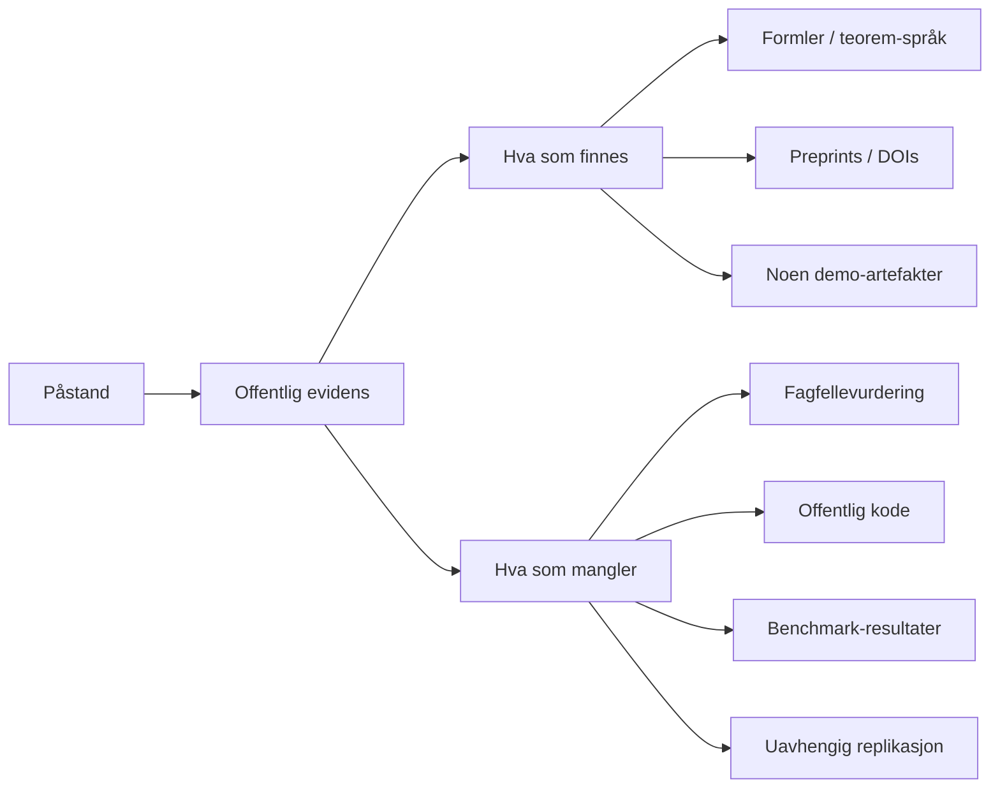

# Peethamber og VectorPeak Research

**Executive summary.** De offentlige kildene viser et reelt, aktivt og matematisk ambisiøst forsknings- og markedsføringsspor rundt Vallikat Peethamber / VectorPeak: en stor mengde Finextra-innlegg fra april–juni 2026, seks identifiserbare preprints/papirer, flere eksplisitte formler og teorem-lignende påstander, samt minst én offentlig demo-app under “Cosmic Meta-Layer”-paraplyen. Det positive er at flere påstander er formulert slik at de *kan* falsifiseres. Det negative er at jeg ikke fant fagfellevurderte publikasjoner for de fire sentrale påstandene du ba om, ingen offentlig kode fra de undersøkte primærkildene, ingen offentlig tilgjengelig WCET-CAN-rapport, og svært begrenset reproduksjon på standard datasett/benchmarks. Min samlede vurdering er derfor: **interessant og ikke-triviell, men foreløpig under-validert**. For Valo bør dette behandles som et mulig forsknings-/samarbeidsspor, ikke som en verifisert byggestein i stacken før uavhengig matematisk vurdering og enkel reproduksjon er gjennomført. citeturn16view0turn20view0turn21view0turn23view0turn23view1turn25view1turn29search3

## Kilder og publikasjonskatalog

Jeg prioriterte primærkilder: Finextra-innlegg, PhilArchive-preprint, ResearchGate-poster/preprints, forfattersider/profiler, samt den offentlige demoen jeg fant. En viktig observasjon er at **Finextra-metadataene ikke er konsistente**: profil/innleggssider viser både *61 opinions* og en arkiv-widget med *2026 (41)*, mens de fem offentlige arkivsider jeg kunne enumerere viser **50 synlige oppføringer** mellom 18. april og 21. juni 2026. Dette er et lite, men reelt, kvalitetssignal om at bibliografien bør verifiseres direkte med forfatteren før man legger noe juridisk eller kommersielt på den. Finextra merker også disse tekstene som **external author content without editing**. citeturn23view0turn6view0turn1view0turn2view0turn7view0turn6view1turn23view2

### Finextra-artikler siste 12 måneder

**Juni 2026, synlig i offentlig Finextra-arkiv:** *The Mathematics That Could Rewrite Banking Regulation*; *Why Fintech's Cloud Infrastructure Is Only as Reliable as Its Weakest Assumption*; *The Equity Premium Puzzle Wasn't About Risk — It Was About Information Structure*; *Why the Financial Services Industry Should Stop Waiting for AGI*; *Certified AI at the Edge: What the WCET-CAN Theorem Means for AI in Regulated Industries*; *Why historical VaR is wrong by design*; *The Noise That Should Not Exist — And What It Means for Financial Risk*; *A Mathematical Measure of AI Alignment*; *How a Zero-Parameter Mathematical Kernel Could Finally Bridge the Gap*; *When a 282-Year-Old Math Problem Gets Solved — What It Means for Fintech*. citeturn1view0turn23view0turn23view1turn23view2

**Mai 2026, synlig i offentlig Finextra-arkiv:** *The Quiet Model Risk Nobody Talks About: Why Your Scenarios Cannot Be Reproduced*; *We Finally Have a Formula for the Next Financial Crisis — And It Changes Everything for Banking*; *When the Network Breaks: Why Systemic Risk Models Are Asking the Wrong Question*; *Why India's Credit Gap Won't Be Closed by Better Machine Learning*; *India's Payment Miracle Has a Structural Problem Nobody Is Measuring*; *The Volatility Smile Has Been Hiding Something the Industry Has Chosen Not to See*; *Why Tipping Points Are the Climate Risk That Financial Services Cannot Model — Yet*; *Why Your Financial ML Model Passes Validation and Fails in Production*; *Why the Financial System Still Cannot Answer the Most Important Question in Risk Management*; *The Stablecoin Threshold Problem: Why We Keep Getting Blindsided*; *The Hidden Cost of Hyperparameter Guessing in Financial AI*; *When Breaches Cascade: Why Financial Networks Need a New Model of Cyber Risk*; *Why NIST's Post-Quantum Standards Matter More for Financial Services Than Any Other Sector*; *Beyond Prediction: Why Financial Services Needs Causal Architecture at the Core of Its AI Models*. citeturn2view0turn7view0

**Slutten av april 2026, synlig i offentlig Finextra-arkiv:** *Why Causal Value Attribution Will Define the Next Frontier of Agentic AI in Financial Services*; *Beyond Prediction: Why DeFi Risk and Crypto Market Transmission Demand Causal Fuzzy Cognitive Maps*; *Why Crypto Markets Need Causal AI — And Why Statistical Models Keep Failing Them*; *Why Financial Crime Networks Demand a Different Kind of AI*; *The Invisible Blind Spot in Banking's Agentic AI Revolution*; *The Hidden Feedback Loops Destroying Value in Your Bank — And Why Nobody Is Measuring Them*; *Why Quantum Fintech Needs a New Diagnostic Language*; *Convergent Causal AI: Why the Financial Services Industry Needs It*; *The EU AI Act Has a Hidden Requirement. Causal Models Are the Answer.*; *Process Discovery Is Broken. Enterprise Causal Graphs Are What the Industry Actually Needs.*; *Why Financial Risk Models Must Go Causal*; *Why the CFO's Next Hire Won't Be Human — It Will Be a Causal Graph*; *Beyond the Chatbot: Why Financial Services Firms Need Causal Knowledge Graphs*; *Borderless Fintech Has a Causality Problem. Causal AI Is the Solution.*; *The SaaS Apocalypse Is Real. Causal AI Is the Escape Route.*; *Causal Topologies: The Strategic Advantage India's IT Services Industry Has Been Waiting For*. citeturn7view0turn6view1

**Tidlig april 2026, synlig i offentlig Finextra-arkiv:** *The Agent Economy: Why Agentic Commerce Cannot Scale Without Causal Architecture*; *Daisy Chains, Dominoes, and the Causal Architecture of Payment System Resilience*; *The Generative Economy of Causal AI - Creating Jobs*; *The Language the Financial Industry Doesn't Have Yet*; *The Causal Security Layer: Securing Investment and Retail Banks*; *Why Financial Services Cybersecurity Needs a Causal Layer — And Why It Needs It Now*; *The Causal Architecture of Global Digital Transactions*; *The Control Point Locator Algorithm - Governing Agentic AI In Fintech*; *The Causal Architecture For Financial Services*; *The Compute Wall: Why Scaling Transformers Is the Wrong Race*. citeturn6view0

### Preprints, rapporter og andre identifiserbare publikasjoner

De **offentlig identifiserbare** forskningsarbeidene jeg fant, er disse:

- **The Meta-Generative Principle: Toward a Causal Theory of Self-Sustaining Systems** — PhilArchive-preprint; eksplisitt merket *“Submitted as a preprint. Not yet peer-reviewed”* og eksplisitt beskrevet som en *theoretical position paper* som åpner spørsmålet for videre formalisering. citeturn16view0turn22search0  
- **A minimal derivation of the Roche tidal disruption limit from a gravitational fixed-point condition** — ResearchGate-preprint, DOI **10.5281/zenodo.20049783**. citeturn20view0turn41search0  
- **Opinion Polarization on Social Networks as a Phase Transition: A Fixed-Point Analysis with Policy Implications** — ResearchGate-preprint, DOI **10.13140/RG.2.2.10574.42562**. citeturn20view0turn29search1  
- **One Threshold, Two Cascades: A Unified Percolation Model of Cyber Breach Propagation and Opinion Polarization on Networked Systems** — ResearchGate-preprint/listing. citeturn20view0turn45search0  
- **NeuroDistance: A Multi-Dimensional Proximity Index for Neural Architecture Across Phylogenetic Scale…** — ResearchGate / Vectorpeak Research scientific contributions. citeturn20view0turn21view0  
- **Individual Minds as Projections of a Collective Adelic Structure: Phase Transitions and Scaling Laws in Cognitive Networks** — ResearchGate-preprint, DOI **10.5281/zenodo.20242208**. citeturn21view0turn46view0  

I tillegg fant jeg en offentlig demo under samme større ramme: **DepegGuard — Stablecoin Systemic Risk Intelligence**, publisert som en live webapp med eksplisitt “first-principles derivation”, samt **ClimateGuard**, som bruker en “canonical” formulering og KMS/Curie-språk. Dette er ikke i seg selv fagfellevurdering, men det er et faktisk offentlig artefakt. citeturn30search0turn30search1

## Vurdering av nøkkelpåstandene

Tabellen under oppsummerer statusen slik den fremstår i offentlige kilder.

| Påstand | Primærkilde | Bevis/proof offentlig? | Offentlig kode? | Peer-reviewed? |
|---|---|---:|---:|---:|
| Zero-parameter matematisk kernel for å koble klima-/fysikkbegreper til finansielle risikobegreper | Finextra: *How a Zero-Parameter Mathematical Kernel Could Finally Bridge the Gap* citeturn23view1turn24view2 | Nei, bare beskrivende påstand og eksempel-score | Ikke funnet i undersøkte kilder | Nei |
| AI alignment-mål fra objective vocabulary alene, før deployment, uten atferdsdata | Finextra: *A Mathematical Measure of AI Alignment* citeturn23view0turn25view2 | Nei, ingen offentlig teoremtekst/preprint funnet for akkurat dette kravet | Ikke funnet i undersøkte kilder | Nei |
| WCET-CAN-teoremet: formell WCET-grense for NN via Lipschitz-bounds og bounded inputs | Finextra: *Certified AI at the Edge…* citeturn25view1 | Delvis beskrevet, men full rapport/proof ikke offentlig tilgjengelig i kildene jeg fant | Ikke funnet i undersøkte kilder | Nei |
| Cosmic Meta-Layer som first-principles meta-rammeverk på tvers av domener | Finextra + PhilArchive + ResearchGate-preprints + demoapp citeturn16view0turn23view3turn29search0turn46view0turn30search0 | Delvis: enkelte delpåstander har teorem- og formelutsagn; selve paraplyrammen er ikke offentlig lukket/validert | Demoapp finnes; kode ikke funnet | Nei |

### Zero-parameter mathematical kernel

**Hva som hevdes.** Finextra-artikkelen beskriver en “zero-parameter canonical kernel” som plasserer klima-/fysikkbegreper og finansbegreper i et felles matematisk rom og bruker avstander/similariteter til å oversette “flood” til f.eks. “credit default” eller “collateral loss”, uten treningsdata, kalibrering eller historiske tapsdata. Eksempelverdier som oppgis er blant annet flom→kredittdefault **0,51**, heat stress→produktivitetsfall **0,57**, wildfire→P&C-claims **0,56**. citeturn24view2

**Metode og nødvendige antagelser.** Offentlig beskrivelse tilsier et semantisk-geometrisk opplegg: definisjonsspråket til konsepter antas å være tilstrekkelig til å konstruere et felles rom, og en “self-dual mathematical object” sies å gi den kanoniske kjernen. For at dette skal være gyldig, må minst tre sterke forutsetninger holde: at begrepsdefinisjoner kanonisk representerer domeneinnhold; at samme struktur gjelder på tvers av domener; og at de valgte definisjonene er robuste mot formulering/parafrase. Ingen offentlig tilgjengelig formal definisjon av kjernen, ingen bevisgang og ingen benchmark følger med artikkelen. citeturn24view2turn23view1

**Formelle utsagn og validering.** Jeg fant **ingen offentlig preprint eller teknisk rapport** som beviser akkurat denne klima–finans-kjernen. Det som finnes offentlig, er artikkeltekst med eksempelpoeng og forretningsmessige implikasjoner. Derfor er status i dag: **påstanden er matematisk formulert nok til å kunne testes, men den er ikke offentlig validert**. citeturn24view2turn33view3turn33view4

### AI alignment measure fra objective vocabulary

**Hva som hevdes.** Finextra-artikkelen hevder at man kan måle avstanden mellom et systems objective specification og menneskelig intensjon **før trening/deployment**, uten atferdsdata, ved å bruke samme “canonical kernel”. Eksemplene som gis er sycophancy-risiko i wealth management, reward hacking i trading, og et “structural alignment score” der et “zero-parameter objective” skårer **0,91** mens et rått reward-maximization objective skårer **0,42**. citeturn23view0turn25view2

**Metode og nødvendige antagelser.** Den offentlige metodeskissen forutsetter at **ordlyden i målfunksjonen** er bærer av nok semantikk til å forutsi senere misalignment-mønstre, og at både “intent”, “misalignment patterns” og “safety/oversight vocabulary” kan formaliseres som referansepunkter i samme rom. Dette er en sterk antagelse: mange alignment-feil kommer fra miljø, verktøy, RL-signal, evalueringssløyfer eller skjulte proxyer, ikke bare fra tekstlig målbeskrivelse. citeturn25view2turn36view2

**Formelle utsagn og validering.** Jeg fant **ingen offentlig tilgjengelig artikkel/preprint** for akkurat dette målet, bare Finextra-innlegget. Det er heller ingen offentlig benchmark, ingen kode og ingen resultater mot etablerte evalueringssett i kildene jeg undersøkte. Dermed er dette foreløpig best lest som **en interessant hypoteseklasse**: hvis det stemmer, er det nyttig; men per i dag er evidensen i offentligheten for svak til å bruke det som produksjonsnær modellrisiko-instrument. citeturn23view0turn33view0turn33view1turn33view2

### WCET-CAN-teoremet

**Hva som hevdes.** Finextra-artikkelen sier at WCET-CAN gir den første formelt sertifiserbare øvre grensen for neural nettverks-inferens på bounded sensor inputs. Kjernen er omformuleringen “execution time as a function of input”; hvis denne er Lipschitz-kontinuerlig over et begrenset inputdomene, kan maksimal variasjon bindes analytisk. Artikkelen oppgir en konkret bound-struktur:  
**WCET ≤ (worst measured time in corpus) + (analytical extrapolation margin)**, der marginen beregnes fra nettverkets Lipschitz-konstant, en konstant fra et “self-dual mathematical object”, og dekningradiusen til timing-korpuset over sensorspace. Det hevdes også at dette kan kombineres med klassiske verktøy som aiT/RapiTime for hardware overhead. citeturn25view1

**Metode og nødvendige antagelser.** Offentlig metode krever minst: bounded inputdomene; målbar/smooth runtime-funksjon; en beregnbar og tilstrekkelig stram Lipschitz-øvre grense; et representativt timing-korpus med kjent covering radius; og en additiv sammensetning mellom den dataavhengige variansen og hardware-komponenten. Hver av disse antagelsene er i seg selv tung i sanntidslitteraturen. citeturn25view1turn44search5

**Formelle utsagn og validering.** Her er det viktigste kritiske punktet: jeg fant **ingen offentlig teknisk rapport eller fagfellevurdert artikkel** som faktisk presenterer theorem statement og proof for WCET-CAN; Finextra-artikkelen sier bare at rapporten “is available as a technical report from VectorPeak Research”. Samtidig vet vi fra etablert litteratur at **eksakt** beregning av Lipschitz-konstanter for nevrale nettverk generelt er NP-hard, og at nyere arbeid bruker øvre grenser og semidefinit/programmering eller strukturutnyttelse, ikke et generelt sertifiseringsresultat av typen som hevdes her. Praktisk real-time-litteratur for NN går ofte en helt annen vei: timing-predictable hardware og statisk kompilering/scheduling for nettverk uten input-avhengige branches. citeturn25view1turn26view2turn36view3turn36view4turn37view1

**Dom.** Dette er den **mest interessante** og samtidig **mest krevende** påstanden. Hvis den holder, er den svært betydningsfull. Med bare publikt tilgjengelig evidens i dag er den likevel **ikke verifisert**. citeturn25view1turn36view3turn37view1

### Cosmic Meta-Layer

**Hva som hevdes.** “Cosmic Meta-Layer” fremstår som et paraplybegrep for en first-principles meta-ramme som ifølge Finextra skal “derive results across physics, finance, linguistics, biology, and cryptography from first principles”. Det finnes minst tre tydelige offentlige uttrykk for dette: den finansielle Finextra-artikkelen om “Critical Leverage Formula”; PhilArchive-preprinten om **Meta-Generative Principle**; og adelisk/p-adisk preprint om kollektiv intelligens med seks eksplisitte teoremer og numerisk verifikasjon. I tillegg finnes live-artefakter som DepegGuard og ClimateGuard. citeturn23view3turn16view0turn46view0turn30search0turn30search1

**Metode og nødvendige antagelser.** Den underliggende MGP-preprinten er eksplisitt forsiktig: den kaller seg selv en **conjecture**, et “opening of the question”, og sier at formaliseringen og variational principle er arbeid for fremtiden. Det er et godt tegn epistemisk sett. Men den adeliske preprinten tar et mye sterkere sprang: den hevder seks teoremer fra genetisk kode via p-adisk geometri til kollektiv intelligens og EEG-frekvenser, inkludert en “parameter-free prediction” for gamma-oscillasjoner med 18 % relativ feil. Dette er meget sterke kryssdomeneantagelser. citeturn16view0turn46view0

**Formelle utsagn og validering.** Her er bilden blandet. MGP-kjernen er **ikke bevist** offentlig; den er eksplisitt programmatisk. Adelik-papiret hevder derimot at seks teoremer er bevist og numerisk verifisert. Problemet er at ingen av disse arbeidene i offentligheten jeg fant er fagfellevurdert, og jeg fant ingen uavhengige replikasjoner. Dermed er CML som **forskningsprogram** reell, men CML som **etablert vitenskapelig fundament** er foreløpig ikke dokumentert. citeturn16view0turn46view0turn29search0

## Plausibilitet og sammenligning mot litteraturen og LIM

Mot **etablert alignment-litteratur** er Peethambers alignment-påstand både ambisiøs og underbygget svakere enn normalen. Peterson og Gärdenfors utvikler to kvantitative mål for value alignment basert på **conceptual spaces** og demonstrerer dem på ChatGPT-3, et medisinsk klassifikasjonssystem og COMPAS. ValueCompass evaluerer alignment **kontekstuelt** på fem LLM-er og 112 mennesker over fire scenarier. Voudouris mfl. argumenterer for at måling av hva AI-systemer *kan komme til å gjøre* er en disposisjons- og kontekstavhengig måleoppgave. Mot dette bakteppet er Peethambers påstand om et **vocabulary-only, pre-deployment, behavior-free** alignment-mål potensielt virkelig ny — men offentlig evidens er også klart svakere enn i de sammenlignbare arbeidene. citeturn36view1turn40view0turn36view2turn25view2

Mot **klima–finans-litteraturen** er nærmeste paralleller ikke “kanoniske null-parameter-kjerner”, men eksplisitte modeller og ontologier. BIS-papiret om å inkorporere fysisk klimarisiko i kredittmodeller utvider Vasicek-modellen med en fysisk risikofaktor og peker eksplisitt på behovet for geolokasjon, klimadata og damage functions. Weichel mfl. bygger en offentlig ontologi/knowledge graph for klimarisiko i kredittrammeverk. Det betyr at Peethambers klimakjerne, dersom den virker, ville være metodisk ny i praksis; men per i dag står den uten den dokumentasjonsstigen disse mer konvensjonelle tilnærmingene har. citeturn39view1turn39view0turn24view2

Mot **real-time/NN-litteraturen** er WCET-CAN-påstanden den mest krevende. Scaman mfl. viser at eksakt Lipschitz-beregning er NP-hard selv for enkle ReLU-nett, og Pauli mfl. arbeider med estimering/øvre grenser ved hjelp av kontrollteori og SDP. I nyere real-time-arbeid for NN-predictability søker man ofte timing-garantier via spesialhardware, statisk scheduling og komponentiserte WCET-estimater, ikke via et generelt analytisk teorem over bounded sensor spaces. Dette betyr ikke at WCET-CAN er feil; det betyr at **bevisbyrden er høy**, og at den offentlige dokumentasjonen foreløpig ikke bærer hele vekten av påstanden. citeturn36view3turn36view4turn37view1

**Mot LIM, slik du beskrev det i prompten,** er likheten først og fremst i ambisjon: begge forsøker å etablere first-principles-strukturer uten fitting som skal generalisere på tvers av domener. Forskjellen er at det offentlige materialet rundt Peethamber i dag er **bredere og mer spekulativt**, men **svakere reprodusert**. Hvis LIMs styrke er en smalere, dypere og mer målbar struktur, er Peethambers styrke heller bred hypotesedannelse og aggressiv problemreframing. På nåværende evidens fremstår Peethamber derfor som **nærmere LIM i temperament enn i verifikasjonsnivå**.

## Hull, anbefalt validering og samarbeidsrisiko

Det sentrale gapet er ikke “mangel på ideer”, men **mangel på offentlig verifiserbare mellomledd** mellom idé og robust kunnskap: full theorem statements, antagelseslister, bevisskisser, kode, benchmarks og uavhengig reproduksjon. Det finnes også en **affiliasjons- og IP-uklarhet** i materialet: Finextra-profilen er knyttet til VectorPeak Technologies, én artikkel omtaler forfatteren som forsker ved CurieQ, og enkelte preprints/deler bruker betegnelser som “Cosmic Meta-Layer Research” og “Vectorpeak Research”. Dette må avklares før samarbeid. citeturn23view0turn23view3turn16view0turn29search1turn46view0

For **Valo** ville jeg lese disse arbeidene grundigst først: **Meta-Generative Principle** for å forstå den filosofiske/metodiske kjernen; **Individual Minds as Projections…** fordi det er det mest theorem-tunge CML-dokumentet; **Opinion Polarization…** fordi det er den mest klassiske, falsifiserbare fixed-point/percolation-typen; og deretter kreve **hele WCET-CAN technical report** før videre vurdering. Som sammenligningsgrunnlag ville jeg parallellese Peterson & Gärdenfors, ValueCompass, Voudouris mfl., Pauli mfl., Bouchard/Scaman (Lipschitz), BIS-papiret og Weichel-ontologien. citeturn16view0turn46view0turn29search1turn25view1turn36view1turn40view0turn36view2turn36view3turn36view4turn39view1turn39view0

De mest nyttige **enkle, reproducerbare valideringstestene** for Valo er disse:

- **Alignment-målet:** Bygg et lite, offentlig eval-sett med objective-specs og tilhørende risikoområder, og test om målet rangerer *safety-/oversight-nære* beskrivelser over *reward-hacking-/sycophancy-nære* beskrivelser. Kjør i tillegg paraphrase-stabilitet. Bruk åpne sycophancy-data fra Anthropic/SycophancyEval og en reward-hacking-benchmark for LLM-agenter som ekstern validering av om et “vocabulary-only score” faktisk korrelerer med observerbar oppførsel. Mål: AUROC, Spearman-korrelasjon, top-k retrieval og paraphrase variance. citeturn42search0turn42search3turn42search7turn42search10turn42search1turn42search6  
- **Klima-kjernen:** Lag en ekspertmerket konseptparsliste fra NGFS/BIS/UNEP FI/ECB-materiale og test om kjernen rangerer kjente relasjoner høyt. Deretter gjør en enkel downstream-test ved å kombinere **FEMA National Risk Index** med **Freddie Mac Single Family Loan-Level Dataset** og se om begrepsmappingen forbedrer en enkel risiko-rangering eller feature selection mot en ontologi-/knowledge-graph-baseline. Mål: precision@k, MRR, ekspert-enighet og inkrementell prediksjonsgevinst. citeturn43search9turn43search1turn39view1turn39view0turn38search2turn43search10  
- **WCET-CAN:** Velg én statisk arkitektur og én input-avhengig/dynamisk arkitektur, kjør på fast edge-hardware, og mål om bounden noen gang brytes, hvor stram den er, og hvor mye den avhenger av dekningradius og timing-korpus. Sammenlign mot klassisk målingsbasert WCET og mot predictable-deployment-arbeid som bruker spesialhardware/scheduling. Mål: **soundness** (0 violationer), **tightness ratio** (bound / empirisk maks), beregningstid og sensitivitet for hardware load. citeturn25view1turn44search5turn44search0turn37view1  
- **Cosmic Meta-Layer generelt:** Start ikke med kosmologi. Start med den minst kostbare, mest falsifiserbare påstanden, for eksempel percolation-/polariseringsmodellen eller stablecoin-depeg-formelen i demoen. Det gir raskest signal om hvorvidt “first-principles” her betyr reell prediktiv struktur eller bare elegant narrativ. citeturn29search1turn30search0

**Samarbeidsrisikoen** er derfor treleddet: teknisk risiko (påstandene er ikke tilstrekkelig reprodusert), styringsrisiko (markedsføring og forskning flyter delvis sammen i Finextra-materialet), og IP-risiko (uklar rollefordeling mellom person, VectorPeak, CurieQ og eventuelle Zenodo-/ResearchGate-objekter). For Valo betyr dette at eventuelt samarbeid bør være **eval-first, IP-second, go-to-market last**. citeturn23view2turn23view3turn16view0turn46view0

**Forslag til visualiseringer for en intern valideringspakke hos Valo:** en ROC-kurve for alignment-score mot menneskemerkede objective-specs; et “bound tightness”-stolpediagram for WCET-CAN mot baselines; og en retrieval-matrise for klima-begrep → finansbegrep med ekspertfasit.

## Due diligence-sjekkliste

Før enhver formell dialog eller avtale ville jeg krevd denne minimumslisten:

- **Publikasjonsstatus per påstand:** Er dette fagfellevurdert, preprint, intern rapport eller markedsartikkel? Få ett dokument per claim, med DOI/versjon/hash. citeturn16view0turn46view0  
- **Eksakt teoremtekst og antagelser:** For WCET-CAN og canonical kernel må dere få theorem statement, definition section og full antagelsesliste, ikke bare prose. citeturn25view1  
- **Reproduserbar kode eller i det minste en frossen kjørbar artefakt:** commit-hash, lisens, eksempeldata, expected outputs. I de primærkildene jeg undersøkte var dette ikke offentlig lenket. citeturn20view0turn21view0turn23view2  
- **Uavhengig faglig review:** én matematiker for formalisme, én domenespesialist for anvendelse, og én ingeniør for benchmark/reproduserbarhet.  
- **Affiliasjon og IP:** avklar hvem som eier hva mellom Vallikat Peethamber, VectorPeak Technologies, CurieQ, “Vectorpeak Research” og “Cosmic Meta-Layer Research”. citeturn23view0turn23view3turn46view0  
- **Standard-/sertifiseringspåstander:** hvis WCET-CAN knyttes til IEC 61508, ISO 26262 eller DO-178C, få en uavhengig vurdering fra noen som faktisk jobber med sertifiseringsløp. citeturn25view1  
- **Pilot før partnerskap:** avtal én liten, velavgrenset blindtest med forhåndsdefinerte suksesskriterier før dere bruker tid på dypere kommersiell integrasjon.

**Åpne spørsmål / begrensninger.** Jeg fant ikke en offentlig, fullstendig teknisk rapport for WCET-CAN, ingen offentlig preprint direkte for alignment-målet eller klima-kjernen, og ingen offentlig kildekode i de undersøkte primærkildene. Det er derfor mulig at noe dokumentasjon finnes privat eller bak direkte kontakt, men det er *ikke* offentlig verifiserbart per nå.