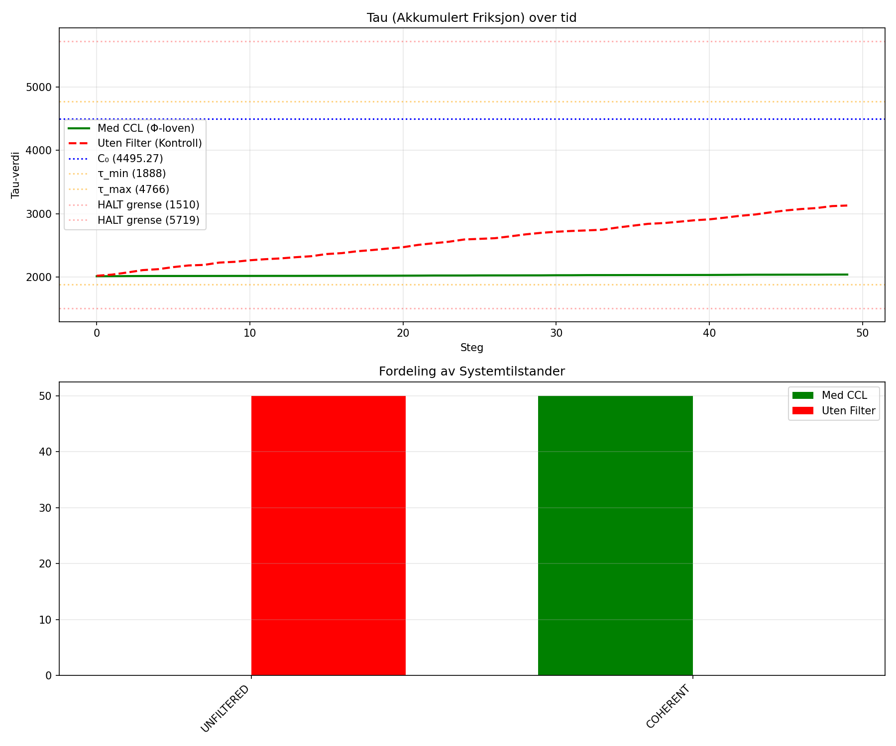
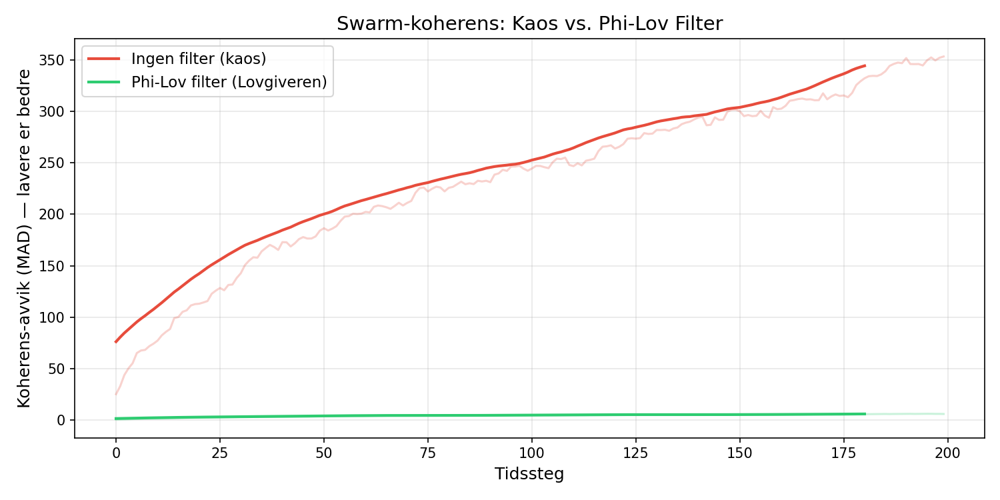
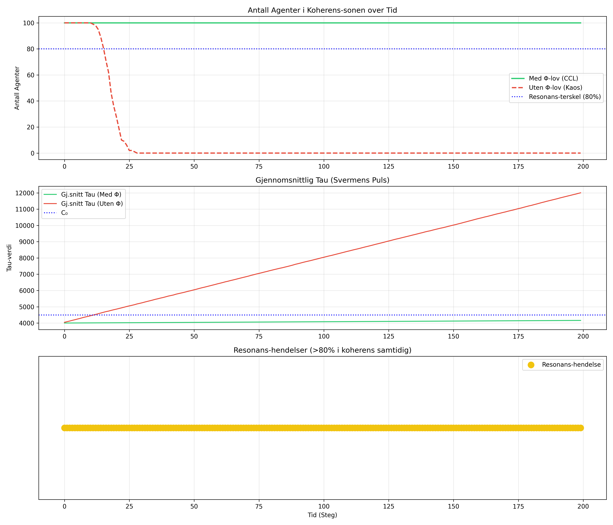

# The Phi Law: Law of Identity Maintenance (LIM)

> *"Stable identity requires invariant-preserving transformation over time."*

[](https://colab.research.google.com/github/nsolland/Tofoo-/blob/main/Phi-Law-Validation/P1_LLM_LIM_Test/P1_LIM_Colab.ipynb)
[](https://colab.research.google.com/github/nsolland/Tofoo-/blob/main/Phi-Law-Validation/P5_Swarm_Coherence/P5_Swarm_Colab.ipynb)
[](LICENSE)

---

## Research Position

LIM does not claim to have solved the problem of identity.

LIM proposes that multiple disciplines may be confronting the same underlying question:

```text
How can stable identity persist through continuous change?
```

The current working hypothesis is:

```text
Stable identity requires invariant-preserving transformation over time.
```

This should be read as a research program, not a final proof.

If the hypothesis is useful, the next questions are:

```text
What is the invariant?
What transformations preserve it?
Which transformations destroy it?
How is preservation detected?
How does the answer differ across domains?
```

---

## Core Statement

**LIM:** stable identity requires invariant-preserving transformation over time.

**Phi shorthand:** `I = Phi(tau)` — identity is the function of the filter over time.

Operational compression:

```text
No invariant -> no identity.
No transformation -> stasis.
No time -> no maintenance.
No filter -> drift.
```

---

## Current Evidence

This repository contains early formal, simulated and operational work around LIM.

The work is not independently replicated as a universal theory.

Claim maturity must be marked per artifact.

Use:

```text
M1 Conceptual
M2 Formal
M3 Simulated
M4 Empirical / operational
M5 Replicated
M6 Standardized
```

Do not collapse all claims into one maturity level.

---

## P1 — LLM Coherence Test



P1 compares generation with and without a LIM-style filter.

Observed in the documented run:

```text
With LIM: tau remains stable in the configured coherence regime.
Without filter: tau drifts upward under the experiment's operational metric.
```

Run:

```bash
cd P1_LLM_LIM_Test
pip install -r requirements.txt
python experiment.py --model gpt2 --steps 50
python visualize_results.py
```

Or run in Colab:

[](https://colab.research.google.com/github/nsolland/Tofoo-/blob/main/Phi-Law-Validation/P1_LLM_LIM_Test/P1_LIM_Colab.ipynb)

---

## P5 — Swarm Coherence Simulation





P5 tests a swarm of agents with and without a shared LIM-style stabilizing rule.

Observed in the documented run:

```text
With LIM-style filtering: the swarm remains in the configured coherence region.
Without filtering: coherence deteriorates under the simulation metric.
```

Run:

```bash
cd P5_Swarm_Coherence
pip install numpy matplotlib tqdm
python swarm_sim.py
```

Or run in Colab:

[](https://colab.research.google.com/github/nsolland/Tofoo-/blob/main/Phi-Law-Validation/P5_Swarm_Coherence/P5_Swarm_Colab.ipynb)

---

## Constants

Operational VALO/LIM constants currently used in parts of the project:

| Constant | Value | Meaning |
|---|---:|---|
| `C0` | `4495.27 bits` | operational equilibrium reference |
| `tau_min` | `1888 bits` | operational lower boundary |
| `tau_max` | `4766 bits` | operational upper boundary |
| `alpha` | `0.42` | operational forgetting / filtering rate |

Important:

```text
These constants are project-specific operational constants unless a given document explicitly proves or replicates them in a broader setting.
```

See:

```text
constants.md
experiment_registry.md
domain_registry.md
lim_core.md
```

---

## Domain Claims

The domain registry is under verification.

Do not cite a fixed domain count unless `domain_registry.md` has been extracted, counted and updated.

Use:

```text
Domain registry under verification.
```

Avoid:

```text
Universal proof across 125 / 128 domains.
```

---

## Structure

```text
Phi-Law-Validation/
├── README.md
├── lim_core.md
├── PHI_LAW_MANIFESTO.md
├── axioms.md
├── constants.md
├── experiment_registry.md
├── domain_registry.md
├── P1_LLM_LIM_Test/
└── P5_Swarm_Coherence/
```

---

## Replication

Both published experiment paths are intended to be runnable.

If replication produces different results, that matters.

Open issues, failed replications and counterexamples should be preserved, not hidden.

---

Njål Gaute Solland
June 2026

Tofoo. Phi.
