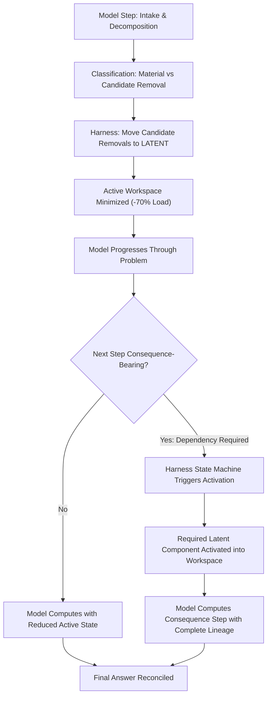

# NJAL-R02 — Governed Reactivation Run v0.1

Registration status: PREREGISTERED  
Execution status: NOT STARTED / DESIGN IN PROGRESS  
Evidence status: NO OUTCOME EVIDENCE  
Parent observation: NJAL-R01 NO_GO, where reversible latent workspace organization successfully reduced active workspace load by 70.5% and protected multi-phase accuracy (+37.5 pp over irreversible pruning in Tier 3), but self-directed model re-activation broke at H4 (62.5% vs preregistered $\ge 80\%$), causing formal dependency preservation to fail (58.3% vs $\ge 90\%$).

---

## 1. Core Thesis & Theoretical Separation

The empirical trajectory across ROP-R01 and NJAL-R01 isolates two distinct failure modes:

* **ROP-R01 (Irreversible Pruning):**  
  `model classification ──▶ model-directed deletion ──▶ irreversible dependency destruction`
* **NJAL-R01 (Reversible Latent Workspace):**  
  `model classification ──▶ reversible latent state ──▶ model-directed restore ──▶ reactivation failure (62.5%)`

### Primary Invariant Evolved

1. `CLASSIFICATION_IS_NOT_DELETION_AUTHORITY` (established in NJAL-R01)
2. `LATENT_AVAILABILITY_IS_NOT_RESTORE_AUTHORITY` (established from NJAL-R01 outcome)
3. `EXECUTION_HARNESS_HOLDS_CONSEQUENCE_AUTHORITY` (core principle of NJAL-R02)

> **Latent availability solves the irreversibility problem, but not the reactivation problem.**  
> Self-directed language models cannot be granted state authority over their own memory topology. The solver has **working rights (computation and transformation)**, while the execution harness retains **state authority (lineage tracking and consequence-bearing activation)**.

---

## 2. Experimental Question

Does moving from self-directed model reactivation (`C3-R-M`) to deterministic dependency-triggered reactivation (`C3-R-G`) resolve the reactivation failure mode identified in NJAL-R01, lifting pre-consequence restore to $\ge 90\%$ without degenerating back to $C2$ full-workspace size?

---

## 3. Conditions (Clean 3-Arm Ablation)

Hold all task semantics, models, temperatures, prompt baselines, and answer keys strictly constant across three matched conditions:

### C2 — Decomposition Only (Control Baseline)
* Full explicit decomposition.
* All components and intermediate values remain active in the workspace throughout all steps.
* No removal or stashing operation permitted.

### C3-R-M — Model-Directed Reversible Workspace (NJAL-R01 Baseline)
* Explicit decomposition and component classification.
* Candidate removals are moved to latent state, never deleted.
* Latent components remain addressable, but the model must autonomously identify missing dependencies and issue explicit `RESTORE` requests.
* Replicates the exact protocol tested in NJAL-R01.

### C3-R-G — Governed / Deterministic Reactivation (Njål-Metoden v0.2)
* Explicit decomposition and component classification.
* Candidate removals are moved to latent state, never deleted.
* **Deterministic Consequence Gating:** The execution harness monitors problem progression. Before any consequence-bearing step that depends on a dormant or latent component, the harness activates the required component into the active workspace.
* Decoys (`DECOY_DISPENSABLE`) and terminal results (`RESOLVED_TERMINAL`) remain latent, preventing workspace bloat.
* The model receives guaranteed, sufficient state at each calculation boundary without carrying administrative overhead.

---

## 4. The Governed State Pipeline

---

## 5. Frozen Hypotheses (Risky Predictions)

* **H1 — Governed Restore Elevation:**  
  $C3\text{-}R\text{-}G$ achieves pre-consequence material restore rate $\ge 90\%$ (a minimum $+25\text{ pp}$ elevation over the $62.5\%$ observed under $C3\text{-}R\text{-}M$).
* **H2 — Dependency Preservation Restoration:**  
  $C3\text{-}R\text{-}G$ required dependency preservation rate is $\ge 90\%$ and outperforms $C3\text{-}R\text{-}M$ by $\ge 25\text{ pp}$.
* **H3 — Active Workspace Preservation (No Degeneration to C2):**  
  $C3\text{-}R\text{-}G$ mean active workspace size is at least $50\%$ below $C2$, demonstrating cognitive offloading without bloating active state.
* **H4 — Correctness Non-Inferiority:**  
  $C3\text{-}R\text{-}G$ accuracy is no more than $5\text{ pp}$ below $C2$.

---

## 6. Kill / Stop Rules

Stop progression and reject the claim if:
1. $C3\text{-}R\text{-}G$ pre-consequence restore rate $< 90\%$.
2. $C3\text{-}R\text{-}G$ dependency preservation $< 90\%$.
3. $C3\text{-}R\text{-}G$ active workspace reduction vs $C2 < 20\%$.
4. $C3\text{-}R\text{-}G$ correctness drops more than $5\text{ pp}$ below $C2$.
5. Answer key, manifest, or condition labels leak into the blind scoring process.

---

## 7. Deliverables

* Frozen task set (72 tasks across Tier 1, 2, 3)
* Frozen dependency map with consequence-trigger gates
* Assignment manifest with frozen seed
* Two-process isolated harness with deterministic state machine
* Independent blinded scoring logs
* Comparative analysis report ($C2$ vs $C3\text{-}R\text{-}M$ vs $C3\text{-}R\text{-}G$)
* Final Decision declaration
